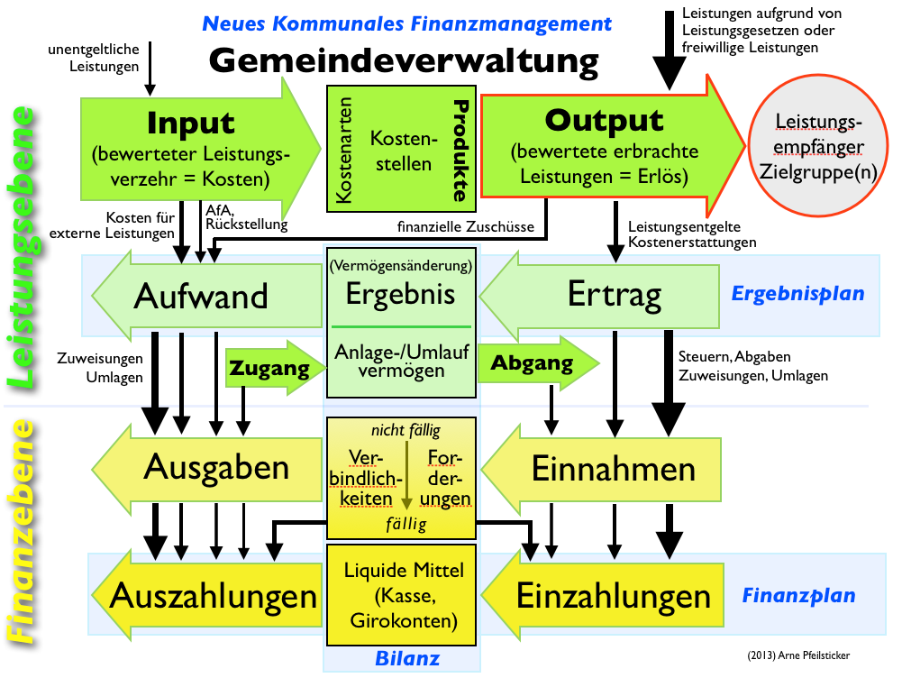
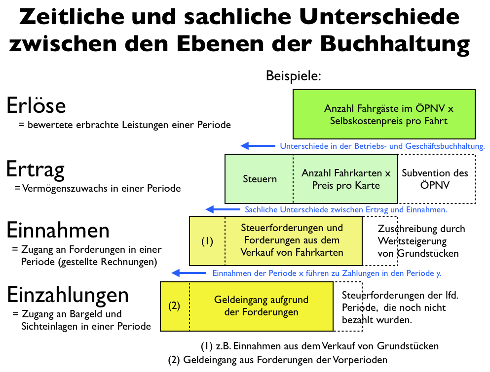
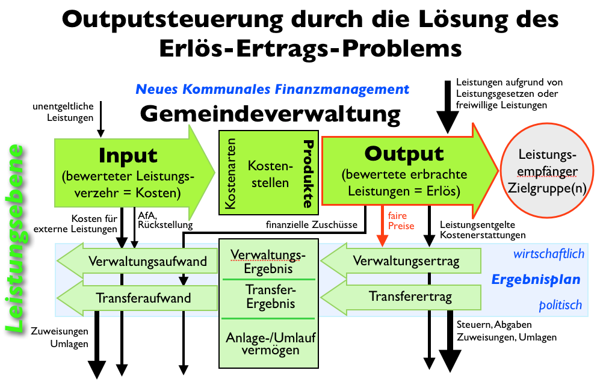
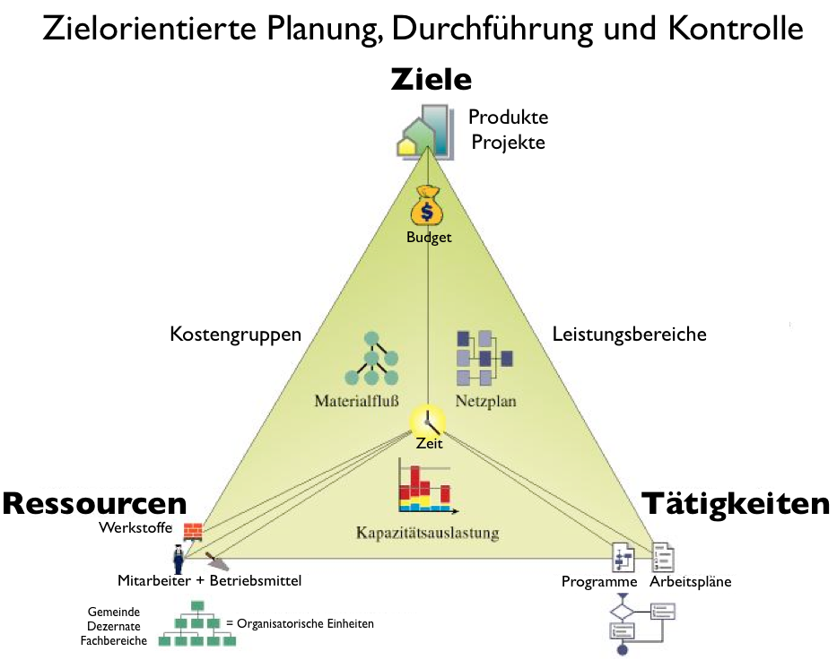
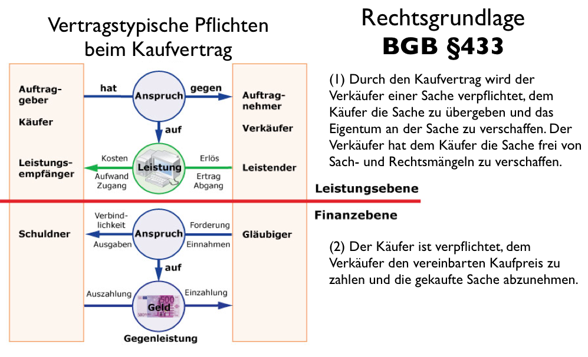

# iNKF -- Infrastruktur für das Neue Kommunale Finanzmanagement
#### Business-Case für ein kommunale Data-Warehousing-Infrastruktur (www.egov-infrastructure.org) und die Visualisierung kommunaler Finanzverwaltungsdaten

```
Autoren: Arne Pfeilsticker, Thomas Bunke
Stand:   20.12.2015
Status:  in Arbeit
Caveat:  Name in Findung: iNKF, NKF+, KLF werden synonym verwendet
```

[TOC]
[toc]
__TOC__

- [1. Mission](#1-mission)
    - [**Bürger zur Haushaltskompetenz ihrer Stadt oder Gemeinde befähigen.**](#brger-zur-haushaltskompetenz-ihrer-stadt-oder-gemeinde-befhigen)
- [2 Zielstellung](#2-zielstellung)
    - [2.1  Phase 1: Visualisierung der NKF-Inhalte](#21--phase-1-visualisierung-der-nkf-inhalte)
    - [2.2 Phase 2: iNKF-Studio -- Kommunale Finanz-Management-Software](#22-phase-2-inkf-studio----kommunale-finanz-management-software)
- [3. Probleme von Kameralistik und herkömmlichem NKF](#3-probleme-von-kameralistik-und-herkmmlichem-nkf)
    - [3.4  Übergeordnete Ziele](#34--bergeordnete-ziele)
- [4 Technologie](#4-technologie)
    - [4.1 Visualisierung und Darstellung der NKF-Inhalte](#41-visualisierung-und-darstellung-der-nkf-inhalte)
    - [4.2 Digitale Infrastruktur-Architektur](#42-digitale-infrastruktur-architektur)
- [5 Marktlage](#5-marktlage)
- [6. Technische Details](#6-technische-details)
    - [6.1 Buchhaltung](#61-buchhaltung)
    - [5.3 Die Struktur der Ausgangsdaten](#53-die-struktur-der-ausgangsdaten)
    - [7.4 Datenbankdesign](#74-datenbankdesign)
- [Glossar](#glossar)


### 1. Mission

#### **Bürger zur Haushaltskompetenz ihrer Stadt oder Gemeinde befähigen.**


1. Die **Webanwendung** liefert **Daten-Visualisierung kommunaler Haushaltsdaten** inklusive vielfältiger **Analyse**-Tools. Sie unterstützt kommunale **Abgeordnete** in ihrer Arbeit und gibt engagierten **Bürgern** ein mächtiges **Werkzeug** in die Hand, welches es ermöglicht, die Leistungs-Perfomance ihrer Stadt- oder Gemeindeverwaltung vergleichend und **nutzenorientiert** kritisch zu **bewerten**.

2. **IT-Infrastruktur** und **Datenarchitektur** für die Implementierung einer sachgemäßen **Buchhaltung** im Sinne der **neuen kommunalen Finanzordnung (NKF)**, welche die Unzulänglichkeiten herkömmlicher, auf Unternehmen ausgelegter Buchhaltungssysteme überwindet.

### 2 Zielstellung
#### 2.1  Phase 1: Visualisierung der NKF-Inhalte
Die Webanwendung bietet eine klare und benutzerfreundliche Oberfläche, die die Daten des NKF-Systems in Form von zusammenfassenden Tabellen, Infografiken und farbigen Landkarten darstellt.

> offensichtlich und verständlich

Abgeordnete und interessierte Bürger* sollen einfacher, effektiver und verständlicher Zugang zu den kommunalen Daten erhalten. Dadurch wird Transparenz aktiv hergestellt und so eine wichtige politische Forderung erfüllt. Verständlichkeit entsteht dabei durch Darstellung der Fakten, ohne eine implizite Interpretation zu liefern. Das Gremium (Gemeinderat, etc.pp.) wird bei seiner Kontrollfunktion unterstützt und kann objektiv bessere finanzierungsrelevante Entscheidungen treffen.

> Kosten-Nutzen-Informationen statt abstrakter Kostenstellen

Daten sind  immer mit Bedeutung verknüpft. Bei der Darstellung liegt der Hauptaugenmerk folgerichtig auf den Inhalte der Daten  und auf der kommunalwirtschaftlichen Bedeutung die sie enthalten.


#### 2.2 Phase 2: iNKF-Studio -- Kommunale Finanz-Management-Software

> Erheblich mehr Leistung mit erheblich weniger Kosten

In Phase zwei soll eine Finanz-Management-Software für die Gemeinden entwickelt werden, das sie bei folgenden operativen Prozessen der Gemeindeverwaltung unterstützt. Das Neue daran ist, dass die gesamte Buchhaltung indirekt über diese primären Geschäftsvorfälle abgewickelt werden kann.

1. Produkte und Produktionsprozesse planen und durchführen
2. Angebote einholen
3. Aufträge vergeben
4. Rechnungen erstellen und Zahlungen veranlassen

Damit sind die Verwaltungs-Ereignisse (auch Fakten genannt),

* Leistung von der Kommune gegenüber dem Bürger,
* Investitionen durch die öffentliche Hand und  
* Gebühren/Abgaben des Bürgers

von vornherein so gestaltet, dass sowohl die rechtliche als auch wirtschaftliche Interpretation korrekt abgebildet wIrd.

Das vorgeschlagene operative System soll in einer Infrastruktur-Architektur aufgebaut werden, die in [Kapitel 4](./Businessplan kommunales Leistungs- und Finanzmanagement.md#42-digitale-infrastruktur-architektur) näher beschrieben wird. Bei den Daten handelt es sich um die Daten des Neuen kommunalen Finanzmanagement (NKF).


## 3. Probleme von Kameralistik und herkömmlichem NKF

Beschrieben wird dieses System in den über 3.000 Seiten umfassenden NKF-Handreichungen für Kommunen. Die dort formulierten Ziele lauten:

* Die Orientierung an den Bedürfnissen der Bürger durch konsequente Produktorientierung und Steuerung über Ziele und Kennzahlen
* Förderung nachhaltiger Haushaltswirtschaft und intergenerativer Gerechtigkeit
* Mehr Transparenz im kommunalen Haushalt für die Bürgerinnen und Bürger

Diese angestrebten Ziele sind zwar genau richtig, aber aufgrund einiger Spezifika bei der Implementierung können diese gar nicht, oder nur sehr eingeschränkt, erreicht werden. Im folgenden werden diese Probleme erörtert.

#### 3.1.1 Problem (NKF): Diskrepanz von Information und Inhalt

Inhalte des NKF-System geben nicht die Informationen wieder, die den Daten kommunalwirtschaftliche Bedeutung geben. Und die Ergebnisrechnung eines Fachbereichs alleine lässt im Allgemeinen eben keine Schlussfolgerungen auf die Wirtschaftlichkeit dieses Fachbereichs zu:

* Beispielsweise hat die Stadt Köln in 2009 für die Produktgruppe 211, Grundschulen,  einen Aufwand für den Unterhalt der Grundstücke und baulichen Anlagen von insgesamt 77 €. Die Stadt Oberhausen hat für die gleiche Position einen Aufwand von 2.518.589 €. Das Verhältnis *Köln*:*Oberhausen* ist somit 1:32.709.
Im Gegensatz dazu hat Oberhausen für die gleiche Produktgruppe einen Aufwand an Mieten und Pachten von 40.390 € und Köln einen Aufwand von 37.333.878 €. Das Verhältnis Köln:Oberhausen ist 924:1.

Dieses einfache Beispiel legt nahe, dass es mit einem einfachen Vergleich von Produkten und Ergebnispositionen nicht getan ist. Selbst Daten, die in einem Verhältnis von 5:1 vorliegen und damit der Bevölkerung der beiden Städte entsprechen, sind mit Vorsicht zu genießen. Zum einen ist die Aufwand-Ertrags-Ebene bei Kommunen keine geeignete Vergleichsebene. Zum anderen weiß man nicht, ob die Produktstruktur vergleichbar ist. Diese Entscheidungen führten auch dazu, dass das NKF-System unnötig komplex wurde.


#### 3.1.2 Lösung (iNKF) Kosten und Nutzen einander zuordnen

Durch die korrekte Zuordnung von Teilbilanzen und Fakten kann  gezeigt werden, ob, in welchem Umfang und in welcher Qualität eine Gemeinde ihre Aufgaben erfüllt hat.

#### 3.2.1 Problem (NKF): Kassenorientierung  als disfunktionales Anreizsystem

> In zeiten knapper Kassen werden wichtige Entscheidungen, die die Zukunft der Kommune determinieren, als unbezahlbar abgetan. Das kann sehr negative Konsequenzen auf die Beteiligungsdemokratie haben und eine Investitions-Stau auslösen. Leistungskürzungen und Erhöhung der Abgabenlast werden honoriert. Das führt zu Austerität statt solider, nachhaltiger Finanzen.

In Kommunen sind die Einnahmen an die Steuergesetze und Abgabenordnung  gebunden; die Leistungen an die Bürger an Leistungsgesetze. Diese Zweiteilung führt dazu, dass auf der Grundlage der Ergebnisrechnung keine Aussage über das wirtschaftliche Verhalten der Kommunen oder ihrer Ämter gemacht werden kann.

Aus der Sicht der doppelten Buchführung stehen in einer Gemeinde die Gewinner und Verlierer von vornherein fest. Die Ämter die Steuern und Abgaben eintreiben sind die strahlenden Gewinner und Ämter für Schulen, Jugend, Sport, Parks, etc. werden als belastende Verlustpositionen empfunden:

* Vergleicht man die Ergebnisrechnung einer Gemeinde mit einem Supermarkt, dann wäre das ungefähr so, wie wenn man behaupten würde, dass nur die Kassierer/innen einen Gewinn erwirtschaftet haben und alle anderen Mitarbeiter machen nur Verluste und kosten nur Geld.

#### 3.2.2 Lösung (iNKF): Produkt- und Gemeinwohlorientierung

>Das Kerngeschäft der Gemeinden ist das Gemeinwohl.

Die Gewinne oder Verluste in den Ergebnisrechnungen haben in der kommunalen Rechnungslegung eine ganz andere Bedeutung und Aussagekraft als in einem Unternehmen. Im Gegensatz zu solchen sind Kommunen gemeinwohlorientiert: Schulen, Kindergärten oder selbst die Aufrechterhaltung der öffentliche Ordnung dienen dem Gemeinwohl -- und nicht der Mehrung von Eigenkapital und *shareholder value*.

Die Orientierung an den Leistungen, die Gemeinden für ihre Bürger erbringen (Produktorientierung) verfolgt das Ziel, weg von einer Input- und hin zu einer Output-Steuerung zu kommen.

Dennoch wird die positive Seite der unternehmerischen Gewinnorientierung nicht vernachlässigt, welche im sparsamen und wirtschaftlichen Umgang mit Ressourcen besteht, sowie sich  an den Wünschen und Bedürfnissen aller Interessengruppen orientiert. Diese Aspekte tragen neben der *ad hoc* auf soziale Nachhaltigkeit fokussierte Gemeinwohlorientierung zu der finanziellen und ökologischen Komponente von Nachhaltigkeit bei (3-Säulen-Modell).


#### 3.3.1 Problem (NKF): Komplex und kompliziert

Aufgrund der Komplexität kann das NKF-System in den Gemeinden nicht wirklich umgesetzt und gelebt werden. Tatsächlich (**TODO** mit Zitat belegen, Interview mit Kämmerer) empfinden die Gemeinden das NKF-System als eine erhebliche Mehrbelastung mit sehr begrenztem Nutzen.
Durch die unsachgemäße Einführung der Doppelten Buchführung haben sich die Kommunen eine zweckentfremdete Rechnungslegung zugelegt, die eigentlich von und für gewinnorientierte Unternehmen entwickelt wurde.


##### Negativbeispiel: Hierarchien in Matrixstruktur

Die Folge sind riesige Tabelle, die wenig relevante Daten enthalten. Beispielsweise hat die Tabelle "71147-14i" der Kölner Finanzbuchhaltung über 5,8 Mill. Zeilen (Auszahlungen nach Gemeinden x Auszahlungskonten x Produktgruppen = 442 x 153 x 87) pro Jahr – aber weniger als 10% der Zeilen enthalten Informationen.


#### 3.3.2 Lösung (iNKF): Spezifische Rechnungslegung implementiert

„Der Haushalt ist und bleibt das zentrale Steuerungs- und Rechenschaftsinstrument in der kommunalen Verwaltung. Künftig muss er eine Grundlage für die Outputsteuerung statt der bisherigen Inputsteuerung darstellen. Neben den Erträgen und Aufwendungen sowie die Einzahlungen und Auszahlungen als haushaltswirtschaftliche Rechengrößen kommt der Produktorientierung eine besondere Bedeutung zu. Sie zeigt sich in den Teilplänen des gemeindlichen Haushaltsplans als örtliche Steuerungsebene.“5

Wir haben eine solche Rechnungslegung entwickelt, die den spezifischen Aufgaben und Bedürfnissen der Gemeinden gerecht wird.

#### 3.4.1 Problem: Streit um die „richtige“ Rechnungslegung

In allen klassischen Buchhaltungssystemen werden die Geschäftsvorfälle nach bestimmten Kriterien und damit nach einer bestimmten Interpretation gebucht. Diese Kriterien sind in den Rechnungslegungsvorschriften festgelegt. Dabei entsteht zwangsläufig der Kampf um die „richtige“ Interpretation. Die Rechnungslegung nach HGB unterscheidet sich von der Rechnungslegung nach US-GAAP oder IFRS. Es macht einen erheblichen Unterschied, ob z.B. ein Gebäude nach dem Zeitwert mit z.B. 100.000 € oder nach dem aktuellen Marktwert mit 500.000 € in der Bilanz steht.

In klassischen Rechnungslegungssystemen kommt es durch die Buchung eines Geschäftsvorfalls nicht nur zu einer bestimmten Interpretation von Fakten, sondern wertvolles Fakten- und Beziehungswissen geht teilweise verloren.
In den klassischen Rechnungslegungssystemen werden teilweise maschinell und teilweise manuell aus den buchungsrelevanten Geschäftsvorfällen Buchungen generiert bzw. abgeleitet. Die Buchungen werden auf Konten gesammelt und als Datensätze in Datenbanken gespeichert. Für die Rechnungslegung werden die Buchungen auf den Konten saldiert und durch manuelle und maschinell generierte Abschlussbuchungen ergänzt. Danach werden ein oder mehrere Konten in den Bilanzpositionen und Positionen der Gewinn- und Verlustrechnung zusammengefasst.

#### 3.4.2 Lösung (iNKF): Trennung von Fakten und Interpretationen

In der multidimensionalen Buchhaltung besteht eine strikte Trennung von Fakten und der Interpretation dieser Fakten.
In der Datenbank werden nicht die Buchungen (= interpretierte Fakten), sondern nur die Geschäftsvorfälle (= Fakten) gespeichert. Die Bilanz oder Gewinn- und Verlustrechnung wird dann automatisiert aus diesen Fakten berechnet. Die automatisierte Berechnung ist die in Programme und Interpretationsschemata gegossene Interpretation der Fakten. Die Buchungssätze sind in der multidimensionalen Buchhaltung lediglich ein Zwischenergebnis, das zur Dokumentation gespeichert werden kann. Durch die Trennung von Fakten und der Interpretation der Fakten können die Fakten, auch rückwirkend, nach beliebig vielen und unterschiedlichen Interpretationen bewertet werden. Diese unterschiedlichen Interpretationen können als unterschiedliche Sichten auf die Fakten verstanden werden. Der Streit um die „richtige“ Rechnungslegung und Bewertung wird insofern beigelegt, dass man unterschiedliche Sichtweisen zulässt.


### 3.4  Übergeordnete Ziele
> *"Der Weg zur globalen Demokratie führt nicht durch die Staaten. Er führt durch Städte. Die Demokratie wurde in der antiken Polis geboren. Ich glaube, sie kann in der globalen Kosmopolis wiedergeboren werden. Auf dieser Reise von Polis zu Kosmopolis können wir die Macht der Demokratie wieder entdecken auf einer globalen Ebene. Einen Völkerbund können wir nicht kreieren. Das ist gescheitert. Aber einen Städtebund. Keine Vereinten [..] Nationen, sondern die Vereinten Städte der Welt." (Benjamin Barber, [TED-Talk][4])*
[4]: [https://www.ted.com/talks/benjamin_barber_why_mayors_should_rule_the_world/transcript?language=de1
#### 3.4.1 Kooperation
Von unserer Infrastruktur werden nicht nur Gemeinden in der Bundesrepublik, sondern Gemeinden weltweit profitieren.

Wir glauben, dass die Kommunen für Demokratie und Wohlstand in der Welt eine Schlüsselrolle einnehmen und dass diese Rolle in der globalisierten Welt noch an Bedeutung gewinnen wird. Wir glauben, dass kooperatives Verhalten unter den Gemeinden, auf Basis von neutralen Vergleichskennzahlen, den Wunsch der Kommunen, wirtschaftlich unabhängig und demokratisch fortschrittlich organisiert zu sein, besser erfüllen kann, als wenn diese versuchen das Wettbewerbsprinzip der Unternehmen zu übernehmen.

#### 3.4.2 Synergieeffekte schaffen

Jede Gemeinde, die am iNKF-System angeschlossen ist, hat automatisch Zugriff auf die nicht vertraulichen Daten aller Teilnehmerinnen. Vertragsvorlagen, Planungsunterlagen, Arbeitspläne und praktische Erfahrungen könnten so effektiv geteilt werden und zu erheblichen Synergieeffekten führen.

Erst das Wissen, wo die entscheidenden Unterschiede in der Produktion und in den Kosten liegen, ermöglicht es den Gemeinden zu reagieren. Dazu müssen aber die relevanten Daten den SachbearbeiterInnen und EntscheidungsträgerInnen ohne zusätzlichen Aufwand zur Verfügung stehen. Das iNKF leistet genau dies.

Wenn beispielsweise eine Gemeinde einen neuen Kindergarten plant, dann stehen ihr automatisch alle Unterlagen aller realisierten und in Realisierung befindlichen Kindergärten zur Verfügung. Ein Sachbearbeiter könnte diese Unterlagen nicht nur für die eigene Planung nutzen, sondern aus diesen Erfahrungen lernen und sich gegebenenfalls mit den Kollegen anderer Städte austauschen. Von der Planung einzelner Produkte bis zu ihrer Realisierung können so Gemeinden voneinander profitieren und lernen.

#### 3.4.3 Gemeinsame konstruktive Politik
Für die VertreterInnen in den Parlamenten besteht ein erhebliches Profilierungspotential, wenn Kritikpunkte der Gemeindefinanzierung klar herausgearbeitet werden können und sich daraus konkrete Verbesserungsvorschläge einbringen lassen.

#### 3.4.4 Berichte
Dadurch, dass die Daten semantisch gespeichert sind, ist eine teil-automatischen Erstellung von Berichten möglich, zumindest, wenn es um die Erläuterung der Finanzdaten geht

## 4 Technologie
### 4.1 Visualisierung und Darstellung der NKF-Inhalte
Bei den zu visualisierenden Daten des NKFs geht es um die Darstellung:

1. des Vermögens (Bilanz),
2. der Entwicklung des Vermögens (Ergebnisrechnung),
3. der Zahlungen (Finanzrechnung) und
4. der darauf aufbauendend Kennzahlen.

Dabei gibt es mehrere Dimensionen entlang derer die Daten aggregiert werden können.

1. Fachbereich – Dezernat - Gemeinde – Landkreis – Region – Bundesland - Bund
2. Leistung - Produkt – Produktgruppe – Produktbereich – Produktfeld (Politikfeld)
3. Struktur des Vermögens: Bereiche – Kontenklassen – Kontengruppen - Konten
4. Zeiträume: Tag – Woche – Monat – Jahr – Jahre


### 4.2 Digitale Infrastruktur-Architektur

Eine Infrastruktur-Architektur besteht aus einer möglichst einfachen und funktionalen Benutzerschnittstelle zu einem komplexen Datensystem.  

#### 4.2.1 OrientDB

Als zugrundeliegende Datenbank wird OrientDB verwendet, welche sowohl als klassische SQL-Datenbank funktioniert, aber auch volle Graphdatenbank-Funktionalität mitbringt. Das lässt die Datenstruktur offen und ermöglicht modellgetriebene und [agile](http://www.i-views.de/de/blog/item/agile-daten) Entwicklung. Außerdem ist das Graphenmodell mit dem Prinzip der Linked Data perfekt kompatibel.

Weitere Vorteile von OrientDB:

- bietet die Möglichkeit über Serverseitige Funktionen die komplette Middleware leicht zu deployen.
- beinhaltet einen Tomcat-Server
- bringt eine REST-API mit
- beinhaltet ein Web-zugängliches Datenbank-Management-Studio.

#### 4.2.2 Linked (Open) Data

Auf lange Sicht sollen Gemeinden Schnittstellen vermöge eines RDF-Schemas bereitstellen (RDF=researchable description framework).

Damit folgen wir einer Vision von Tim Berners Lee, dem Erfinder des Internets, welcher auch ein Konzept entwickelt hat und seither aktiv bewirbt, wonach ein neues Format, Daten im Internet zur Verfügung zu stellen, semantisch orientiert ist, das sogenannte *semantic web*. Das bedeutet, dass Relationen zwischen Datensätzen, sogenannte Prädikate, als solche gespeichert werden, anstatt wie bisher, Prädikate nur implizit als bestimmte Stichwörter an einer nicht näher spezifizierten Stelle im Dokument zu platzieren. So wird das Semantische Web zu einer den Globus umspannenden Graph-Datenbank.

Zum einen soll nun das (Graph-)Datenbank-Modell als Präkursor für das zu entwickelnde RDF-Schema dienen, zum anderen ermöglicht die Gleichgestalt der beiden, Schnittstellen zwischen Datenbank und semantischem Web kostengünstig herzustellen.

Wikipedia und, für das semantische Web, DBpedia sind Beispiele und Ansporn wie durch Kooperation und persönliches Engagement ein Werk entstehen kann, das selbst die besten und renommiertesten Lexika überflügelt hat.


### 4.2.3 Transparenz und Komplexitätsreduktion

Die semantische Präsentation von Daten bedeutet, dass Informationen aus den Daten (Objekte) die Fragestellung (Prädikate) beantwortend illustrieren, und so Erkenntnisgewinn für den Betrachter (Subjekt) ermöglichen.

Für die Gemeinden sind folgende Fragen von Bedeutung:

1. Machen wir betriebswirtschaftlich gesehen einen guten Job?
  a. Welche Gemeinde erledigt eine Aufgabe besser als wir?
  b. Worin liegt genau der Unterschied? – Arbeitsablauf, Skaleneffekte, etc.
2. Wie gut setzen wir die politischen Zielvorgaben um?
3. Wo sind unserer Stärken und/oder Schwächen?
4. Wirtschaften wir nachhaltig und sparsam?
5. Ist die Zahlungsfähigkeit der Gemeinde gesichert?

#### 4.4 Betrachter-Schnittstelle (UI für die BürgerInnen)

Für die Visualisierung der Leistungsstruktur stehen folgende Techniken zur Verfügung.


| Dynamische Tabellen | Diagramme | Karten |
|--|--|--|
|Haushaltsdaten in dynamischen Tabellen angezeigen (dynamisch: der Anwender kann entlang der Dimensionen Daten aggregieren oder verfeinern) | Balken-, Tortendiagramme | Darstellung geografischer Information, Choropleth |

>Abbildung: Beispiel Choropleth

cc: Maximilian Dörrbecker, wikimedia

- Einbindung mittels eines open-source Web-Grafik-Framework, wie das auf D3 basierende [Chiasm](https://github.com/chiasm-project/chiasm). Chiasm ermöglicht die reaktive Interaktion des Benutzers mit den Daten. Veränderungen in der Auswahl werden sofort grafisch abgebildet. Das ermöglich Interaktions-Techniken wie *zoom* und *chrossfilter*.


## 5 Marktlage

#### 5.1.1 Problem:

Für Gemeinden und die öffentliche Hand ist es im Allgemeinen mit großem Aufwand verbunden, Änderungen, Erweiterunge, Verbesserungen ihrer IT umzusetzen. Das liegt an der dünnen Personaldecke und der typischerweise spezifisch nicht-IT-orientierten Amtsführung.
#### 5.1.2 Lösung:
#### 5.2.1 Problem:
Kompetenz der Gemeindeverwaltung auf regelgenaue Ausübung bedacht, ordnungspolitisch orientiert
Damit geht ein großer Informationsverlust auf der Bilanziellen Ebene und damit Entscheidungsschwäche auf Investitions-Ebene einher
#### 5.2.2 Lösung:
Informations-Dienstleister für Kommunen
* Erträge und Aufwendungen in einen sachlogischen Zusammenhang mit den Erlösen und Kosten stellen
* spezifischen Aufgaben, die die verschiedenen Schichten der Buchhaltung haben berücksichtigen
* Informationen, die für die politischen und wirtschaftlichen Entscheidungen der Gemeinden bereitstellen
* Lebensqualität erfassen und sichtbar machen

##### Negativ-Beispiele
* Selbst für eine kleine Stadt wie z.B. Heppenheim mit 25.000 Einwohner, einer Stadtverwaltung von 234 Mitarbeitern und einem Ertrag bzw. Aufwand von ca. 38 bzw. 43 Mill. Euro hat dieser Jahresbericht 580 Seiten. Er übertrifft an Seiten den Jahresbericht der der Deutschen Bank mit ca. 98.000 Mitarbeitern und einem Ertrag bzw. Aufwand von 32 bzw. 26 Mrd. Euro.

* Beispielsweise werden in den Finanzplänen der Stadt Bottrop die Positionen laut Spaltenüberschrift nach Einzahlungs- und Auszahlungsarten gruppiert. Tatsächliche werden sie jedoch nach Ertrags- und Aufwandsarten gruppiert. Die Stadt Bochum vermeidet dies indem sie auf eine Spaltenüberschrift verzichtet.

* Die Stadt Bottrop weißt Einzahlungen mit positivem und die Stadt Bochum mit negativem Vorzeichen aus.

* Die Stadt Bochum weißt im Ist-Gesamtfinanzplan 2011 Liquide Mittel in Höhe von 109.128.592,52 € aus. In der Bilanz 2011 werden dagegen Liquide Mittel in Höhe von 2.665.016,50 € ausgewiesen. Der Ansatz in der Bilanz ist vermutlich richtig, während der Ansatz im Gesamtfinanzplan keine Liquide Mittel, sondern eine Finanzierungslücke darstellt.


## 6. Technische Details
###6.1 Buchhaltung

Unter *Ertrag* wird betriebswirtschaftlich die bewertete Leistungserstellung der Gemeinde in einem Haushaltsjahr (Geschäfts- bzw. Wirtschaftsjahr) verstanden. Einen Ertrag stellt dabei jeder gemeindliche Geschäftsvorfall dar, der das Nettovermögen bzw. das Eigenkapital der Gemeinde erhöht.
Konstruktionsfehler: Der Ertrag ist die Vermögenszunahme und nicht die bewertete Leistungserstellung (= Leistung bzw. Erlös). Der gemeindliche Geschäftsvorfall erhöht auch nicht das Nettoverbögen, sondern bestenfalls das Bruttovermögen. Das Nettovermögen entsteht rein rechnerisch als Differenz zwischen Aktiva und Fremdkapital.
Allen Positionen der Aktiva und des Fremdkapitals können konkrete subjektive Rechte zugeordnet werden. Beim Eigenkapital ist das nicht der Fall.
Bei privatwirtschaftlichen Unternehmen besteht ein enger sachlogischer Zusammenhang zwischen den folgenden vier Schichten in der Buchhaltung:
1. Leistungsebene: Erlöse (= bewertete erbrachte Leistungen) - Kosten (= bewerteter Leistungsverzehr) = Betriebsergebnis
2. Erfolgs-/Vermögensänderungsebene: Ertrag – Aufwand = Ergebnis (Gewinn oder Verlust)
3. Ebene der Ansprüche auf Geld: Einnahmen – Ausgaben bzw. Forderungen und Verbindlichkeiten
4. Zahlungsebene: Einzahlungen – Auszahlungen = Zahlungssaldo

Auf der 1. Ebene wird der Leistungsfluss der realen Produktionsprozesse abgebildet und gemessen. Als Erlöse werden die bewerteten erbrachten Leistungen bezeichnet und zwar unabhängig davon, ob sie bezahlt werden oder nicht. Entsprechendes gilt für die Kosten. Der Begriff Erlöse ist im Kontext staatlicher Leistungserstellung irritierend, weil umgangssprachlich mit Erlösen das Geld verstanden wird, das man für eine erbrachte Leitung erhält.
Auf der 2. Ebene wird der kaufmännische Erfolg gemessen. D.h. wie verändert sich das Vermögen des Unternehmens.
Auf der 3. Ebene geht es um Ansprüche auf Geld. Einnahmen sind der Zugang an Forderungen einer Periode; Ausgaben sind der Zugang an Verbindlichkeiten einer Periode.
Die 4. Ebene ist die Zahlungsebene. Fällige Forderungen führen zu Einzahlungen und fällige Verbindlichkeiten zu Auszahlungen. Der wichtigste Aspekt auf der Zahlungsebene ist die Zahlungsfähigkeit sicher zu stellen. D.h. eine Stadt muss jederzeit in der Lage sein ihre fälligen Verbindlichkeiten zu zahlen. Von entscheidender Bedeutung sind daher der zeitliche Verlauf von Einzahlungen und Auszahlungen und der sich hieraus ergebende Saldo.

Gerade bei Kommunen und öffentlichen Haushalten allgemein besteht überwiegend keine Verbindung zwischen z.B. den Steuereinnahmen (= Ertrag) und den abgegebenen Leistungen (= Erlöse), wie z.B. den Aufbau und die Erhaltung der Verkehrsinfrastruktur.
Der Anspruch auf die Leistungen von Kommunen wird zu einem erheblichen Teil über Leistungsgesetze geregelt. Der Ertrag ergibt sich aus den Steuergesetzen und Abgabeverordnungen.
Hier liegt ein wesentlicher Unterschied zu Unternehmen. Erlöse, Ertrag und Einnahmen sind in Unternehmen in der Regel über Kundenlieferverträge gekoppelt.
In Kommunen und öffentlichen Haushalten allgemein ist dies nicht der Fall:
Die Bereitstellung und der Betrieb eines Kindergartens ist eine Leistung der Gemeinde, die gerade nicht in entsprechender Weise das Vermögen der Gemeinde erhöht.
Dagegen erhöhen die Einnahmen aus Grundsteuern das Vermögen der Gemeinde und sind keine bewertete Leistung der Gemeinde. Die Leistung die die Gemeindeverwaltung in diesem Zusammenhang erbringt sind die Aktivitäten im Zusammenhang mit der Steuererhebung.
Erlöse (= bewertete erbrachte Leistungen)  und Erträge (= Zuwachs an Vermögen) können gerade bei Kommunen deutlich auseinander fallen. Die Einnahmen aus dem Verkauf einer Eintrittskarte für ein Schwimmbad zu 3,00 Euro ist ein Ertrag in Höhe von 3,00 Euro, aber der Erlös als bewertet Leistungserstellung zu Herstellungskosten wäre vermutlich 6-8 Euro.
Im Bruch in der Kette Erlöse, Ertrag und Einnahmen liegt der Grund, warum die Ergebnis- und Finanzpläne die angestrebten Ziele des NKFs nicht erreichen können. Die Gewinner im NKF-System stehen von Anfang an fest: Strahlende Sieger sind die Fachbereiche die Steuern und Abgaben kassieren. Alle anderen Fachbereiche sind die systembedingten Verlierer. Die Ergebnisrechnung eines Fachbereichs einer Kommune sagt – im Gegensatz zu einem Fachbereich in einem Unternehmen – nichts über die Wirtschaftlichkeit des Fachbereiches aus.
Analog dazu verhält sich die Aufwandseite:
#####2.2.1.3 Die Rechengröße „Aufwand“
Unter der gemeindlichen Rechengröße „Aufwand“ wird betriebswirtschaftlich der bewertete Güterverzehr der Gemeinde in einem Haushaltsjahr (Geschäfts- bzw. Wirtschaftsjahr) verstanden. Zu Aufwendungen führt daher jeder gemeindliche Geschäftsvorfall, der das Nettovermögen bzw. das Eigenkapital der Gemeinde vermindert.
Auch hier wird der analoge Fehler gemacht: Bewerteter Güterverzehr sind Kosten und nur z.T. auch Aufwand. Aufwand ist der Abgang an Vermögen und zwar unabhängig davon, wie er zu Stande kam.
Die Leistungsstruktur in Kommunen lässt sich aus der Sicht des NKF durch folgendes Strukturdiagramm darstellen:

>

Die Abb. Kommunale Leistungsstruktur visualisiert den Gesamtzusammenhang, der durch das Neue Kommunale Finanzmanagement-System dargestellt wird. Diese graphische Darstellung könnte zu einer interaktiven Benutzerschnittstelle in das NKF-System ausgebaut werden.
Wo das Wort Gemeindeverwaltung steht, könnte eine Dropdown-Combobox sein, aus der man sich die Gemeinde auswählen kann. Nach der Auswahl werden die Übersichtsdaten der ausgewählten Gemeinde angezeigt.  In den einzelnen Pfeilen und Kästen stehen dann die entsprechenden Beträge. Wenn man mit dem Cursor auf einen Betrag zeigt, dann wird die nächste Gliederungstiefe in einem Drilldown-Stil angezeigt. Alle Pfeile und Kästen könnten entsprechend der Höhe des Betrages in entsprechender Größe angezeigt werden. Dadurch könnte man mit einem Blick wesentliche Informationen aus dem Schaubild ziehen.
Um weiter ins Detail zu gehen könnte man dann z.B. ein bestimmtes Produkt auswählen und bekommt die Daten des entsprechenden Teilhaushaltes angezeigt.
Über eine Zeitschiene ließe sich in den einzelnen Pfeilen und Kästen die Entwicklung der Daten für den angezeigten Zeitraum anzeigen.
Ein Verlust könnten rot und Gewinn grün angezeigt werden.
Die Daten des Produktplattes könnten an den entsprechenden Stellen der Grafik eingeblendet werden.
Wenn man auf die Wörter Bilanz, Ergebnisplan oder Finanzplan klickt, dann könnten die Daten in der gewohnten Form angezeigt oder ausgedruckt werden.
Das Schaubild Kommunale Leistungsstruktur funktioniert auch entlang der Dimensionen Gemeinden – Landkreise – Land und Produkte – Produktgruppen – Produktbereiche – Produktfelder
Mit Hilfe des einen einzigen Schaubildes Kommunale Leistungsstruktur könnte man alle Daten des NKF-Systems anzeigen und auf die 580 Seiten Papier verzichten. Und wenn ein bestimmter Sachverhalt auf Papier benötigt wird, dann kann man ihn ausdrucken.


#### 6.1.2 So einfach wie möglich: Buchungsebenen beachten

Die verschiedenen Ebenen in der Rechnungslegung und Verbindung die spezifischen Bedürfnisse öffentlicher Haushalte in Kohärenz bringen:

Die reale Welt einer Gemeinde wird aus der Sicht des Rechnungswesens in vier logische Ebenen abgebildet. Diese Ebenen sind inhaltlich streng voneinander getrennt, aber sachlogisch verbunden. Jeder Ebene ist eine ganz bestimmte Funktion zugedacht.
Der sachlogische Zusammenhang ist vermutlich die Ursache, dass die Begriffe Einzahlung, Einnahmen, Ertrag und Erlöse sowie Auszahlung, Ausgaben, Aufwand und Kosten selbst in der Beschreibung des NKF-Systems nicht immer richtig verwendet werden, obwohl es sich bei den 8 Begriffen um streng voneinander zu unterscheidende Begriffe handelt.
Aufgrund sachlicher Unterschiede zwischen den Ebenen und zeitlicher Verschiebungen ist es z.B. nicht sinnvoll Einzahlungen nach Ertragskategorien zu Gruppieren. Aber genau das, wird im NKF-System gemacht. Jede Ebene muss nach den für die Ebene spezifischen Eigenschaften gruppiert werden. Auf jeder Ebene sollten auch nur die Fragen gestellt werden, für die die Ebene aussagefähig ist.


>

Eine ausführliche und anschauliche Erklärung der obigen Begriffe findet sich hier.
Die Bestandsgröße zu der Einzahlungs- und Auszahlungsebene sind die liquiden Mittel, d.h. Bargeld und Sichteinlagen bei Banken. Mangelnde Liquidität ist neben der Überschuldung die häufigste Insolvenzursache. Auch wenn über Gemeinden kein Insolvenzverfahren verhängt werden kann, hat die Aufrechterhaltung der Zahlungsfähigkeit auch für Gemeinden eine sehr hohe Priorität.
Die Zahlungen sind die Leistungen aufgrund von fälligen Forderungen und Verbindlichkeiten. Die Zeitpunkte und die Höhe der Ein- und Auszahlungen werden also durch die darüber liegende Ebene der Einnahmen und Ausgaben bestimmt.
Auf der Auszahlungsseite ist wichtig, dass immer genügend liquide Mittel vorhanden sind, damit die fälligen Verbindlichkeiten bezahlt werden können.
Da die Zahlungsfähigkeit weder auf Produktebene noch auf Fachbereichsebene sichergestellt werden muss, ist eine Gruppierung der Zahlungen nach Ertrags- und Aufwandskategorien, Investitionen, etc. überflüssig und inhaltlich irreführend. Die Irreführung ergibt sich aus den oben dargestellten Verschiebungen der einzelnen Buchhaltungsschichten.
Wenn jede Schicht der Buchhaltung genau auf die Aufgabe zugeschnitten wird, für die sie gedacht ist, dann lässt sich das Gesamtsystem erheblich vereinfachen. Z.B. könnten alle Teil-Finanzpläne des NKF-Systems ohne Informationsverlust gestrichen werden.
Für eine offene Rechnung spielt es keine Rolle woher diese Rechnung kommt. Entscheidend in diesem Zusammenhang sind die Höhe und die Fälligkeit und genau darauf muss der Bestand an liquiden Mitteln abgestellt werden.
Anstelle der hunderten von Finanzplänen könnte ein einziges Diagramm auf Gemeindeebene treten, das den Verlauf von Ein- und Auszahlungen bzw. Einnahmen und Ausgaben aufzeigt und die Entwicklung der dazugehörigen Bestandsgrößen: Liquide Mittel, Forderungen und Verbindlichkeiten.
ToDo: Beispiel für ein solches Diagramm
Was jedoch fehlt ist eine Aussage, wie ein absehbarer Mangel an liquiden Mitteln finanziert bzw. vermieden wird. In diesem Zusammenhang wäre es z.B. sehr hilfreich, wenn im Haushaltsplan aussagen darüber gemacht werden würden, welche Ausgaben oder Investitionen gegebenenfalls verschoben werden könnten.
Als zusätzliche Information könnte eine Gruppierung der Forderungen und Verbindlichkeiten nach Schuldner und Gläubiger sowie Fälligkeit sein.

#### 6.1.2 …, aber nicht einfacher: Kosten- und Leistungsrechnung
>„Mache die Dinge so einfach wie möglich, aber nicht einfacher!“ (Einstein, *zugeschrieben*)

Der Begriff **Kosten- und Leistungsrechnung** (im folgenden **KLR** abgekürzt) kommt in den 3.092 Seiten NKF-Handreichungen 117-mal vor. Es wird auch auf ihre Bedeutung hingewiesen, aber sie wird weder näher spezifiziert, noch ist ihre Einführung Pflicht. Ihr wird ergänzende und lokale Bedeutung beigemessen und in das Belieben der Bürgermeister gestellt.

Die KLR bildet den wirtschaftlichen Geschäftsbetrieb einer Gemeinde ab.
**ToDo**: Näher ausführen


Die KLR ist jedoch das einzige Instrument, mit dem die Ziele des Neuen Kommunalen Finanzmanagement's erreicht werden können. Nur auf dieser Ebene werden die vielfältigen politischen Entscheidungen neutralisiert und die Wirtschaftlichkeit einer Gemeinde sichtbar.
Auf die KLR kann nicht verzichtet werden. Nur auf der Ebene der KLR ist ein Vergleich der Wirtschaftlichkeit zwischen den Gemeinden möglich.
Die Aufgaben der Ebene KLR sind:

* Selbstkostenermittlung: In der KLR werden die Selbstkosten von einem Gut ermittelt, das ein Unternehmen bzw. Gemeinde produziert. Diese ermittelten Selbstkosten dienen als Basis für die Gestaltung des Verkaufspreises.
* Controlling (Kontrolle der Wirtschaftlichkeit): überwacht Kosten und Leistungen. Schließlich reicht es nicht nur die Selbstkosten zu ermitteln – nachhaltiges wirtschaftliches Handeln ist das erklärte Ziel des NKF-Systems.
* Deckungsbeitragsrechnung: berechnet, ob (bzw. wie viel) ein produziertes Gut zur Deckung der fixen Kosten und zum Gewinn beiträgt. In Gemeinden könnte auf dieser Basis z.B. politische Entscheidungen getroffen werden, wie hoch Eintrittsgelder oder Nutzungsentgelte sind.
* Entscheidungsgrundlage: Die Erkenntnisse, die aus der KLR gezogen werden, könnten eine wichtige Grundlage für die Entscheidungen in den Gemeinden werden.

Zusammenfassend kann also gesagt werden, dass ein Finanzmanagement-System nicht ausreicht. Gebraucht wird ein kommunales Leistungs- und Finanzmanagement-System.

#### 6.1.3 Transparenz: Klare Trennung zwischen Politik und Verwaltung

In der Ergebnisrechnung, d.h. auf der Aufwands- und Ertragsebene, werden politische und wirtschaftliche Faktoren miteinander vermengt und verwischt.
Wenn z.B. für die Eintrittskarten ins Theater im Durchschnitt 20,00 € bezahlt werden und der Selbstkostenpreis jedoch bei 70,00 € liegt, dann sind die 50 € Zuschuss eine politische Entscheidung. Diese politische Entscheidung wird aber nur dann sichtbar, wenn man die Ergebnisse der Kosten- und Leistungsrechnung (KLR) mit den Ergebnissen der Ergebnisrechnung vergleicht.
Aber selbst dieser Vergleich deckt noch nicht die ganze Wahrheit auf, weil ein Teilergebnisplan für das Produkt Theater noch Transferleistungen enthalten kann.
Eine Lösung des Problems könnte in einer Trennung der Ergebnisse in Verwaltungsergebnisse und ein Transferergebnisse liegen.
Erst dann könnte man klar zwischen dem wirtschaftlichen Sachverhalt und den politischen Entscheidungen unterscheiden. Z.B.:

|Selbstkostenpreis laut KLR | 70,00 €|
|---|---|
|- Durchschnittlicher Eintrittspreis lt. Verwaltungsergebnis| -20,00 €|
|= Durchschnittliche Subvention|50,00 €|
|- Transferleistungen Land|-10,00 €|
|- sonstige Transferleistungen Dritter|2,00 €|
|= Subvention durch die Stadt |38,00 €|

Eine Gemeindeverwaltung ist auch ein Geschäftsbetrieb, den das NKF-System steuern möchte.
Die vorgeschlagene Trennung würde bewirken, dass in der Berechnung der Ergebnisse der betriebswirtschaftliche Aspekt klar und sauber von den politischen Entscheidungen und deren Auswirkungen getrennt werden würden. Es sind diese politischen Entscheidungen die derzeit die Ergebnisse verzerren. Da die Verzerrungen nicht durchgängig und einheitlich sind, können selbst die verzerrten Daten nur selten zwischen den Gemeinden verglichen werden. Selbst ein Vergleich innerhalb einer Gemeinde für mehrere Jahre ist mit Vorsicht zu genießen, weil die politische Komponente (= Transferleistung) sich mit der Zeit geändert haben könnte.
Für die Politik wäre es ein erheblicher Fortschritt, wenn die finanziellen Auswirkungen ihrer Entscheidungen genauer sichtbar gemacht und den Leistungsgesetzen zugeordnet werden könnten.
Als Nebeneffekt des Vorschlags könnte man dann ermitteln, ob die finanziellen Mittel, die eine Gemeinde hat, tatsächlich zur Aufgabenerfüllung ausreichen müssten.
Die angemessenen Verrechnungspreise und die Trennung zwischen einem Verwaltungs- und Transferergebnis würden auch dazu bewirken, dass sowohl auf der Produktebene als auch auf der Fachbereichsebene die Verwaltungsergebnisse ausgeglichen sind, wenn die Fachabteilungen wirtschaftlich arbeitet.
Nur auf der Ebene der wirtschaftlichen Ergebnispläne macht es Sinn die Ergebnisse zwischen den Verwaltungen zu vergleichen. Erst dann zeigt ein positives Verwaltungsergebnis an, dass eine Fachabteilung aus betriebswirtschaftlicher Sicht gut gearbeitet hat.
Erst durch die Umsetzung dieser Vorschläge könnte das NKF-System die erklärten Ziele in Angriff nehmen.

>

#### 6.1.4 Qualität buchen: Der fehlende Baustein der Rechnungslegung
(Die folgenden Ideen sind in einem sehr frühen Entwicklungsstadium.)
Die besondere Herausforderung eines Rechnungswesens für die Kommunen ist, die angestrebten Ziele und die Qualität der Haushaltsführung sichtbar und messbar zu machen.
Eine Bilanz ist eine Vermögensaufstellung und eine Ergebnisrechnung zeigt, wie sich das Vermögen in einer Periode verändert hat.
Das Vermögen und seine Entwicklung sind ohne Frage wichtige Aspekte der Haushaltsführung – aber es gibt noch andere Aspekte, die mindestens genau so wichtig sind.
Wäre die Mehrung des Vermögens das wichtigste Kriterium, dann müssten die Gemeinden ihre historischen Rathäuser abreißen und durch Bürosilos ersetzen.
Die doppelte Buchführung misst weder die Qualität noch die Lebensqualität, die durch die Haushaltsführung bewirkt und beeinflusst wird. Freiheit, Gerechtigkeit und Nachhaltigkeit sind z.B. Qualitätskriterien, die in keiner Hinsicht in der kaufmännischen Buchführung sichtbar werden.
Die Gemeinwohlbilanz7 der Gemeinwohlökonomie versucht die Qualität wirtschaftlichen Handelns hinsichtlich des Gemeinwohls sichtbar und messbar zu machen.
Auch Kommunen können hinsichtlich ihrer Haushaltsführung und Aufgabenerfüllung mehr oder weniger dem Gemeinwohl dienen. Wer z.B. immer nur dem billigsten Anbieter den Zuschlag gibt, sollte sich nicht wundern, wenn dieser Preisdruck zu einem Lohndumping führt. Lohndumping ist weder sozial, noch gerecht, noch trägt es zum Gemeinwohl bei.
Das hier vorgeschlagene Gemeinwohlradar verbindet die Ideen der Gemeinwohlbilanz mit den Ideen eines Radardiagramms und einer Zielscheibe.

#### 6.1.4. Vermögensrelevante Geschäftsvorfälle
In einer Buchhaltung werden vermögensrelevante Geschäftsvorfälle bewertet und gebucht und damit dokumentiert.
Ein Buchungssatz ist im Grunde nichts anderes als eine standardisierte Aufzeichnung eines vermögensrelevanten Sachverhaltes. Das Besondere dabei ist, dass diese vermögensrelevanten Sachverhalte mit Hilfe mathematischer Funktionen zu einem Gesamtbild zusammengefasst werden können und so die Bilanz bzw. Gewinn-/Verlustrechnung ergeben.
Erst durch die Bewertung lassen sich Vermögensrechte untereinander vergleichen und mathematisch behandeln. Ohne Bewertung könnte keine Bilanz oder Gewinn- und Verlustrechnung erstellt werden. Der Betrag auf einem Konto ist der durch Bewertung ermittelte Wert der Vermögensrechte, die auf dem Konto dokumentiert werden.
Die Bewertungsrichtlinien sind ein wesentliches Merkmal eines Rechnungslegungsstandards. Es kann z.B. einen erheblichen Unterschied ausmachen, ob eine Immobilie zum „Fair Value“ (= Marktpreis) für 10 Mill. € nach IFRS oder zum Zeitwert für 1 Mill. € nach HGB bewertet wird.
Die Ideen der Buchhaltung lassen sich auch auf nicht-vermögensrelevante Geschäftsvorfälle, wie z.B. gemeinwohlrelevante Geschäftsvorfälle verallgemeinern.
Die Bewertung des Gemeinwohlverhaltens wäre dadurch sehr viel präziser und nachvollziehbarer. Durch die Bewertung der gemeinwohlrelevanten Geschäftsvorfälle werden die Auswirkungen für das Gemeinwohl messbar und könnte Teil einer Bilanz werden und den Gewinn bzw. Verlust eines Unternehmens bzw. einer Gemeinde direkt beeinflussen.
Wie das Immobilienbeispiel zeigt, hat die Bewertung einen erheblichen Einfluss auf den Gewinn bzw. Verlust eines Unternehmens und damit auf die Einkommens- und Vermögensverteilung in der Gesellschaft.
Wenn wir Unternehmen nicht nur als „Durchlauferhitzer“ für Vermögen betrachten, um noch mehr Vermögen zu generieren, sondern in ihrer umfassenden Bedeutung für die Gesellschaft, dann müssen wir auch die Rechnungslegung von der einseitigen Fixierung auf das Vermögen auf eine Berücksichtigung aller gesellschaftsrelevanter Aspekte erweitern.
Wir brauchen eine Rechnungslegung, die nicht nur quantitativ das Vermögen, sondern qualitativ das gesamte Unternehmen bewertet und misst.

#### 5.2.3 Zielorientierte Planung, Durchführung und Kontrolle

Die geplante Output-Steuerung durch das iNKF-System ist nicht nur für die Gemeinde als Ganzes eine gute Idee, sondern kann konsequent über die Dezernate, Fachbereich bis hinunter zu den einzelnen Arbeitsplätzen angewandt werden.
Letzt endlich besteht eine Gemeindeverwaltung aus einem Netz von Input-Verarbeitung-Output-Einheiten, die durch Leistungen miteinander verbunden sind. Dieses Prinzip lässt sich von der obersten Ebene der Gemeinde über die Dezernate, Fachbereiche und den einzelnen Arbeitsplätzen bis auf die Ebene der Produktion der einzelnen Produkte (= Outputs) einer Gemeinde verfeinern.

Um die Produktionsstruktur (= Pfeile) von den Gütern (= Kreise) zu trennen wurden die ursprüngliche Darstellung wie in Error: Reference source not found gezeigt geändert. Die grünen Kreise mit dem schwarzen Rand stellen Zwischengüter dar, die Inputs für andere Abteilungen, etc. darstellen.
Wenn ein Output einmalig oder nur selten erzeugt wird, dann spricht man von einem Projekt, ansonsten sind die Outputs die Produkte (= Güter), die die Verwaltung für die Bürger erzeugt.
Am Beispiel eines Projektes soll die Verfeinerung aufgezeigt werden. Entscheidend ist, dass diese Vorgehensweise bei allen Produktionsprozessen mit dem gleichen einfachen Verfahren durchgeführt werden kann.
ToDo
Auf der untersten Ebene haben wir die Arbeitspakete, die sich ebenfalls nach dem gleichen Input-Verarbeitung-Output-Schema aufbauen lassen. Je nach Kontext spricht man aber z.B. bei der Verarbeitung von Vorgang, Aktivität, Tätigkeit oder Aufgabe. Gemeint ist immer das Gleiche: Die Verarbeitung der Inputs zu den gewünschten Outputs.

In der verallgemeinerten, für alle Produktionsprozesse anwendbare Variante, lassen sich die Inputs in drei Gruppen einteilen: Werkstoffe, Betriebsmittel und Mitarbeiter. Diese Gruppen werden auch Ressourcen genannt. Im Gegensatz zu den Ressourcen stehen die Tätigkeiten, die aus und mit Hilfe der Ressourcen die gewünschten Produkte bzw. Projekte erstellen.
Vorteil dieser Darstellung ist die Anwendung des gleichen Prinzips, vom einzelnen Gut bis zur Gemeinde. Darüber hinaus kann die Aggregation über die Gemeinden hinaus auf Kreise, Regionen und Länder ausgeweitet werden. Es können auch einzelne Produkte und Produktgruppen isoliert betrachtet werden.
Die Gruppierung der Ressourcen führt zu den sog. Kostengruppen. Betrachtet man die Werkstoffe wie sie zeitlich in das Produkt eingehen, dann erhält man den sog. Materialfluss.
Auf der Seite der Tätigkeiten führt die Gruppierung zu den sog. Leistungsbereichen. Die Anordnung der Tätigkeiten im zeitlichen Verlauf und in der logischen Reihenfolge führt zu Netzplänen.
Die Mitarbeiter und Betriebsmittel bilden auf der untersten Ebene die Arbeitsplätze, die die Tätigkeiten ausführen. Im zeitlichen Verlauf führen die Tätigkeiten zur Kapazitätsauslastung der Arbeitsplätze.
Der Zusammenhang wird in Abbildung 1 dargestellt:

>

Erst mit Hilfe des Gesamtpaketes, bestehend aus den Kosten- und Erlösinformationen sowie der Produktionsstruktur, können die Gemeinde ihre eigenen Tätigkeiten bewerten und mit anderen Gemeinden vergleichen.
Beide Aspekte fehlen im NKF-System. Erst wenn eine Gemeinde anhand der Kosten- und Leistungsrechnung z.B. weiß, dass ein Kindergartenplatz erheblich mehr kostet, als in anderen Gemeinden, hat sie einen Anhaltspunkt nach den Ursachen zu forschen. Aber dazu benötigt sie die Produktions- und Kostenstruktur auf den darunter liegenden Ebenen. Auf diesen darunter liegenden Ebenen lässt sich dann z.B. feststellen, dass die Gruppengröße deutlich kleiner ist, als bei den Vergleichskindergärten. Oder es lässt sich z.B. ermitteln, dass die Betriebskosten des Kindergartens deutlich höher sind. Anhand dieser Information lässt sich dann vielleicht feststellen, dass die Kindergärten schlecht isoliert sind und daher erheblich höhere Heizkosten verursachen.
5.2.4 Multidimensionale Buchhaltung
Um den Belangen der Kommunen gerecht zu werden, wird im Folgenden ein Buchhaltungssystem entwickelt, das multidimensionale Buchhaltung genannt wird.
5.2.4.1 Die Grundideen klassischer Buchhaltungssysteme
In einer Buchhaltung werden wertmäßig der Bestand und die Veränderungen der bewertbaren Rechte (= das Vermögen) eines Wirtschaftssubjektes mit Hilfe von Buchungssätzen standardisiert auf Konten dokumentiert.
Die Sachverhalte, die zu Vermögensänderungen führen, werden vermögensrelevante Geschäftsvorfälle genannt.
Die Zuordnung der Geschäftsvorfälle zu den Buchungssätzen erfolgt nach den sog. Rechnungslegungsvorschriften.
Der Betrag auf einem Konto ist der Wert eines bewertbaren Rechtes oder einer Gruppe von Rechten. Die Salden der Konten werden nach einem starren Schema in die Positionen der Bilanz und Gewinn- und Verlustrechnung abgebildet.
In einer Bilanz werden die Vermögenswerte zum Ende des Abrechnungszeitraumes aggregiert und klassifiziert.
Die G+V-Rechnung aggregiert die Wert- und Vermögensänderungen im Abrechnungszeitraum und klassifiziert diese Änderungen.
Die starre Abbildung der Geschäftsvorfälle ist nicht sachlich begründet, sondern dem Umstand geschuldet, dass es bei der Erfindung der kaufmännischen Buchführung keine Computer gab, mit denen komplexe und vielfältige Abbildungen mit vertretbarem Aufwand möglich gewesen wären.
Diese erzwungenen starren Abbildungen führen einerseits zu Brüchen bei der Aggregation der Vermögenswerte und andererseits ist jede getroffene Entscheidung für einen bestimmten Kontenrahmen und einen bestimmten Aufbau der Bilanz und G+V-Rechnung ein mehr oder weniger brauchbarer Kompromiss. Dieser Kompromiss ist ungefähr so, wie wenn man sich eine Schuhgröße einigen würde. Solche Schuhe passen nur in bestimmten und den wenigsten Fällen.  Jeder Kontenrahmen und die dazugehörige Bilanz und G+V-Rechnung sind ein einseitiger Blick auf die Vermögensverhältnisse und die Vermögensentwicklung eines Wirtschaftssubjektes.
Der Begriff „doppelte“ Buchführung rührt daher, dass ein Buchungssatz grundsätzlich aus einerseits Soll- und andererseits Habenbuchungen bestehen. Dabei ist die Summe der Sollbuchungen genauso hoch wie die Summe der Habenbuchen.


Die Einteilung in Soll und Haben reflektiert die Grundstruktur von schuldrechtlichen Verträgen, die sich aus gleichwertigen Verpflichtungs- und Erfüllungsgeschäften zusammensetzen.

>


#### 5.2.4 Die Grundideen der multidimensionalen Buchhaltung

In der multidimensionalen Buchhaltung wird der Sinn und Zweck einer Buchhaltung mit den Möglichkeiten der elektronischen Datenverarbeitung neu umgesetzt. Auf starre Abbildungen wird verzichtet. Sie sind sachlich weder notwendig noch sinnvoll und verkomplizieren eine Rechnungslegung unnötig.
Die verschiedenen Aspekte der betriebswirtschaftlichen Sachverhalte und Geschäftsvorfälle werden in verschiedenen Dimensionen geordnet dokumentiert. Auf diese Weise entsteht ein multidimensionaler Raum aus Fakten. Die Fakten werden dadurch sehr kompakt gespeichert und sind für Auswertungen mittels EDV ideal zugänglich.

Zur Betrachtung und Analyse dieser Fakten können je nach Bedarf Teilräume, Schnitte und Projektionen gebildet werden. Entlang der Dimensionen können die gespeicherten Daten aggregiert, ausgewertet und angezeigt werden. Die so erzeugten vielfältigen Abbildungen können als unterschiedliche Sichten auf das Vermögen, die Vermögensänderungen und betriebswirtschaftlichen Sachverhalte betrachtet werden.
Die klassischen Bilanzen, Gewinn- und Verlustrechnungen entsprechen bestimmten Sichten. Die Restriktionen und Abbildungen für eine bestimmte Sicht können abgespeichert und bei Bedarf wiederverwendet werden.
Aufgrund der fehlenden starren Restriktionen und Abbildungen können in der multidimensionalen Buchhaltung jede beliebige klassische Buchhaltung abgebildet werden. Voraussetzung hierfür ist, dass die hierfür notwendigen Sachverhalte abgespeichert sind.


##### 5.2.4.5 Abstrahieren – Spezialisieren – Verallgemeinern


Wenn die papiergetragene Buchhaltung lediglich nachgebildet wird, dann bleibt sie zum Teil ein zusätzlicher Aufwand. In einer für die elektronische Datenverarbeitung konzipierten Buchhaltung muss für EDV-gestützte Geschäftsprozesse nicht zusätzlich gebucht werden. Die Buchungssätze ergeben sich indirekt per Programm oder Zuordnungstabelle aus den Geschäftsvorfällen.
Auch werden die Buchungssätze nicht durchgebucht, sondern virtuell erzeugt. Unter „durchbuchen“ wird hier verstanden, dass die einzelnen Buchungssätze erzeugt und in Tabellen der Datenbank abgelegt werden. Unter „virtuell erzeugen“ wird verstanden, dass die Buchungssätze einschließlich aller Auswertungen, wie z.B. Bilanz oder die Kosten- und Leistungsrechnung dynamisch aus den gespeicherten Geschäftsvorfällen erzeugt werden.
Beim Durchbuchen gehen wichtige Strukturinformationen verloren. Darüber hinaus soll es dem Nutzer überlassen bleiben, ob z.B. die Kosten- und Leistungsrechnung für ein Produkt, eine Produktgruppe, einen Fachbereich oder für eine Region erstellt werden. Diese generelle Vorgehensweise schließt nicht aus, dass oft nachgefragte Sichten abgespeichert werden, damit sie ohne neu zu berechnen direkt angezeigt werden können.
Bei einer virtuellen Buchhaltung können aus den gleichen primären Geschäftsvorfällen parallel Buchungsdaten nach unterschiedlichen Rechnungslegungsvorschriften erzeugt werden. Eine Gemeinde könnte z.B. ihre eigene Variante der Buchhaltung haben und gleichzeitig könnten für einen landesweiten Vergleich alle Gemeinden nach einheitlichen Rechnungslegungsvorschriften bewertet und ausgewertet werden.


### 5.3 Die Struktur der Ausgangsdaten

Geht man davon aus, dass die zu visualisierenden Daten wie in den Dateien `Bilanz2016.txt` und `Ergebnis2016.txt` aufgebaut sind, dann lässt sich hierzu folgendes sagen:
Die Datei `Bilanz.txt` hat folgende Struktur:

```
Wertfeld 1: Amtlicher Gemeindeschlüssel
Wertfeld 2: Verwaltungsform
Wertfeld 3: Name der Kommune
Wertfeld 4: Signatur
Wertfeld 5: Text der Signatur
Wertfeld 6: Wert
```
Die Datei `Ergebnis20XX.txt` hat folgende Struktur:
```
Wertfeld 1: Amtlicher Gemeindeschlüssel
Wertfeld 2: Verwaltungsform
Wertfeld 3: Name der Kommune
Wertfeld 4: Produktgruppe
Wertfeld 5: Text der Produktgruppe
Wertfeld 6: Konto
Wertfeld 7: Text des Kontos
Wertfeld 6: Wert
```

Die so zur Verfügung gestellten Daten sind für den gedachten Zweck nicht geeignet.
benötigt: für jede Dimension entlang derer die Daten aggregiert werden sollen, eine eigene Spalte.

| .. |  .. |
|---|---|
|Normalisierung | reduziert das Datenvolumen drastisch und wenn die Daten nur auf den untersten Aggregationsstufen der Dimensionen vorliegen, dann können die Daten dynamisch durch den Anwender gesteuert aggregiert werden.|


## 7.4 Datenbankdesign

### 7.4.1 Zielsetzung Datenbankdesign

Visualisierung NKF-Daten: Die Datenbank soll so gestaltet sein, dass damit die Visualisierung der Leistungsstruktur der NKF-Daten als Benutzerinterface durchgeführt werden kann.
Multi-NKF fähig: Die NKF-Daten können sowohl in der Rechnungslegungsvariante einer bestimmten Kommune als auch in einer kommunenübergreifenden einheitlichen Sicht dargestellt werden.
Multiple Rechnungslegung: Die Datenbank wird so strukturiert, dass damit die NKF-Daten nach unterschiedlichen Rechnungslegungsstandards angezeigt werden können. Die unterschiedlichen Sichten sollen auch rückwirkend möglich sein, wenn die Daten in der Struktur der Standardschnittstelle importiert wurden.
Das NKF ist ein Beispiel für einen bestimmten Rechnungslegungsstandard. Dadurch wird die Möglichkeit geschaffen, dass auch andere Bundesländer mit deutlich abweichenden Systemen integriert werden können, oder z.B. die NKF-Daten aus der Sicht der Kameralistik gezeigt werden könnten.
Konkret implementiert wird nur der NKF-Standard, der als Ausgangspunkt und Beispiel für andere Rechnungslegungsstandards verwendet werden kann.
Die Datenbank wird so strukturiert, dass sie als Grundlage für das operative System der Phase 2 verwendet werden kann. Um diese Ziele zu erreichen werden die Daten in einer Art universellen Buchhaltung dokumentiert.

### 7.4.2 Grundstruktur der Datenbank

Buchhaltungen dokumentieren vermögensrelevante Geschäftsvorfälle in Form von Buchungssätzen.
Die entscheidende Idee für die Grundstruktur der Datenbank ist, dass nicht die Buchungssätze, sondern die Geschäftsvorfälle selbst in einer universellen Form gespeichert werden.
Dadurch wird es möglich, dynamisch anhand von formalisierter Rechnungslegungsvorschriften jede beliebige Rechnungslegung zu generieren.
Die buchungsrelevanten Geschäftsvorfälle werden in einer n-stelligen Relation dokumentiert.
Die Daten werden in mehrere Gruppen voneinander unabhängiger Eigenschaften gespeichert. Jede dieser Gruppen bildet eine Dimension entlang der die Daten aggregiert oder verfeinert werden können.
Die Relation wird so aufgebaut, dass später der Zugriff auf die Daten möglichst optimal ist.

Tabelle 1: Inventar (inventory)

|Spaltenbezeichnung|  |Bemerkung|
|---|---|---|---|---|---|
|*Englisch*|*Deutsch*| |
|inventory_id|Inventar-Nr.|Primärschlüssel: Bestands-, Inventar-Nr. Z.B. Bürogebäude|
|part_of|Teil von|FS: Bestands-, Inventar-Nr. gehört zu einem komplexen Vermögenswert. Auf diese Art können zusammengesetzte Vermögenswerte mit unterschiedlichen Wertansätzen oder Eigenschaften gebildet werden. Beispiel: Heizungsanlage (inventory) in einem Gebäude (inventory_parent).|
|client|Mandant|FS: Mandant / Kommune, Zusätzlich kommen
|acquired|erworben am|Ab diesem Datum gehört / soll gehören der Vermögensgegenstand zum Vermögen oder Besitz des Mandanten.|
|disposed|abgegangen am|Ab diesem Datum gehört der Vermögensgegenstand nicht mehr zum Vermögen oder Besitz des Mandanten. (bzw. soll nicht mehr gehören bei Plandaten.)|
|data_type|Datentyp|0=Ist-Daten, Plan-Daten = 10-99, Template-Daten = 100|
|quantity|Menge|Leistungsmenge|
|unit|Maßeinheit|der Leistungsmenge: Stk., kg, cbm, qm, €, etc. oder Fremdwährung|
|product|Produktschlüssel|FS: Leistungs-/Produktschlüssel des inventarisierten Gegenstandes. (Standard:code, z.B. GTIN:9783453146983)|
|name|Name|Name des Inventarisierten Gegenstandes|
|valuation|Wertansatz|z.B. Marktpreis, Selbstkostenpreis, Nominalwert|
|amount|Betrag|Netto-Betrag|
|tax|Steuern|Steuern, die dem Geschäftsvorfall direkt zugeordnet werden können, wie z.B. die MwSt.|
|currency|Währung|Währungseinheit für Netto-Betrag und Steuern|
|project|Projekt|FS: Projekt-ID, falls der Vermögensgegenstand direkt einem Projekt zugeordnet werden kann. Für Direktkostenrechnung.|
|right|Subjektives Recht|FS: Art des inventarisierten Vermögensrechts: Eigentumsrechte, Beteiligungsrechte, Nutzungsrecht, Forderungen/Verbindlichkeiten|
|owner|Eigentümer|FS: zum Eigentümer|
|cancellation_from|Storno von|Fremdschlüssel zu einer Inventar-Nr I1, die von dieser Inventar-Nr I2 storniert wird.|
|cancellation_to|Storno an|Fremdschlüssel zu einer Inventar-Nr. I2, die diese Inventar-Nr. I1 storniert. Durch die Storno-Einträge sollen Stornierungen möglich gemacht werden und gleichzeitig sollen alte Auswertungen anhand des Erfassungsdatums jederzeit wieder hergestellt werden. Dieser Mechanismus ist besonders für fortschreitende Planungsstände hilfreich. Gegebenenfalls müssen Beträge und Mengen auf 0 gesetzt werden, wenn durch die Stornierung Werte nicht geändert, sondern gelöscht werden sollen.|
|entry_date|Erfassungsdatum|Zeitstempel, wann der Geschäftsvorfall erfasst wurde.|
|entered_by|Erfasser|Fremdschlüssel des Erfassers|

Anmerkungen:
Durch die Storno-Einträge sollen Stornierungen möglich gemacht werden und gleichzeitig sollen alte Auswertungen anhand des Erfassungsdatums jederzeit wieder hergestellt werden.
Dieser Mechanismus ist besonders für fortschreitende Planungsstände hilfreich.
Gegebenenfalls müssen Beträge und Mengen auf 0 gesetzt werden, wenn durch die Stornierung Werte nicht geändert, sondern gelöscht werden sollen.


| Spaltenbezeichnung| | Bemerkung|
|---|---|---|
| Englisch| Deutsch | |
| client| Mandant| Fremdschlüssel Mandant / Kommune|
| booking_date| Buchungsdatum| Dieses Datum entscheidet in welches Haushaltsjahr/-periode der Geschäftsvorfall gehört.|
| data_type| Datentyp| 0=Ist-Daten, Plan-Daten = 10-99, Template-Daten = 100|
| transaction| Geschäftsvorfall| FS: Art des Geschäftsvorfalles|
| cause| Rechtsgrund| FS: Rechtsgrund für die Leistung: Vertragsart, § Leistungs- oder Steuergesetz|
| contract| Vertrag| FS Referenz zu konkreten Verträgen oder Vertragstypen|
| inventory| Bestand| FS: Bestands-, Inventar-Nr. der Leistungsquelle. Z.B. Bürogebäude|
| begin| Beginn| Leistungsbeginn|
| end| Ende| Leistungsende|
| quantity| Menge| Leistungsmenge|
| unit| Maßeinheit| der Leistungsmenge: Stk., kg, cbm, qm, €, etc. oder Fremdwährung|
| product| Produkt| FS: Leistungs-/Produktschlüssel|
| valuation| Wertansatz| z.B. Marktpreis, Durchschnittspreis, Selbstkostenpreis, festgesetzter Preis, Nominalwert|
| amount| Betrag| Netto-Betrag|
| tax| Steuern| Steuern, die dem Geschäftsvorfall direkt zugeordnet werden können, wie z.B. die MwSt.|
| currency| Währung| Währungseinheit für Netto-Betrag und Steuern|
| provider| Leistungserbringer| Fremdschlüssel Leistungserbringer bzw. Orga-Einheit des Leistungserbringers.|
| recipient| Leistungsempfänger| Fremdschlüssel Leistungsempfänger bzw. Orga-Einheit des Leistungsempfänger|
| beneficiary| Begünstigte/r| falls abweichend vom Leistungsempfänger. Die Begünstigten können auch Gruppen, wie z.B. Schüler sein.|
| beneficiary_count| Anzahl Begünstigte| Falls die Begünstigten z.B. mehrere Schüler sind, dann kann hier die Anzahl der Schüler eingetragen werden.|
| project| Projekt / Produkt| Projekt-/Produkt-ID, falls eine Leistung direkt einem Projekt oder Produkt zugeordnet werden kann. Für Direktkostenrechnung.|
| right| Subjektives Recht| Art des übertragenen Vermögensrechts: Eigentumsrechte, Beteiligungsrechte, Nutzungsrecht, Forderungen/Verbindlichkeiten|
| cancellation_from| Storno von| Fremdschlüssel zu einer Transaktion T1, die von dieser Transaktion T2 storniert wird.|
| cancellation_to| Storno an| Fremdschlüssel zu einer Transaktion T2, die diese Transaktion T1 storniert. Durch die Storno-Einträge sollen Stornierungen möglich gemacht werden und gleichzeitig sollen alte Auswertungen anhand des Erfassungsdatums jederzeit wieder hergestellt werden. Dieser Mechanismus ist besonders für fortschreitende Planungsstände hilfreich. Gegebenenfalls müssen Beträge und Mengen auf 0 gesetzt werden, wenn durch die Stornierung Werte nicht geändert, sondern gelöscht werden sollen.|
| entry_date| Erfassungsdatum| Zeitstempel, wann der Geschäftsvorfall erfasst wurde.|
| entered_by| Erfasser| Fremdschlüssel des Erfassers|

Tabelle: Geschäftsvorfälle (business transactions)


Mit den Geschäftsvorfällen wird dokumentiert: Wer leistet Was an Wen.
Dabei sollte die Zuordnung so tief wie möglich ansetzen, damit bei der Kostenrechnung möglichst viele Kosten direkt den Kostenträgern zugeordnet werden kann.


Tabelle: persons (legal_entities) – natürliche und juristische Personen und Gruppen von Personen

| Spalte| Deutsche Bezeichnung| Datentyp| Bemerkung|
|---|---|---|---|
| id| Personen-ID| varchar| Primärschlüssel Rechtssubjekt|
| person_kind| Art| int| |
| person_name| Name| varchar| Je nach Art wird der Name unterschiedlich unterteilt.|
| person_begin| Beginn, Geburtsdatum, Gründungsdatum| datetime| |
| person_end| Ende, Totestag, Auflösungstag| datetime| |


|Dimension|Ausprägung (verfeinern <> aggregieren|
|---|---|
|1. Güter|Leistung - Produkt – Produktgruppe – Produktbereich – Produktfeld (Politikfeld)|
|2. Rechtssubjekt|Fachbereich – Dezernat – Gemeinde – (Land-)Kreis – Region – Bundesland - Bund|
|3. Zeit|Datum+Uhrzeit – Tag – Woche – Monat – Jahr – Jahre|
|4. Wertansatz*|Marktpreise, Buchwert, Selbstkostenpreise, Wiederbeschaffungskosten, Barwert|
|5. Vermögen|Eigentumsrechte, Beteiligungsrechte, Forderungen/Verbindlichkeiten|
|6. Plan/Ist|Ist-Daten, Plan 1-Daten, Plan 2-Daten ...|

Die fünf Dimensionen Güter, Rechtssubjekt, Zeit, Wertansatz und Vermögen bilden eine Art Buchungshyperraum, in dem die realen buchungsrelevanten Sachverhalte dokumentiert werden.

*Die Ausprägungen des Wertansatzes sind qualitativ und nicht geordnet und können deshalb nicht verfeinert oder aggregiert werden.

Wie im Folgenden gezeigt werden wird, kann jede beliebige Rechnungslegung als Schnitte, Projektionen und Teilmengen dieses 5-dimensionalen Buchungsraumes betrachtet werden.
Durch die Strukturierung der Daten in diese Dimension wird es möglich, dynamisch unterschiedliche Rechnungslegungssysteme darzustellen. Eine bestimmte Rechnungslegung kann als eine bestimmte Betrachtungsperspektive aufgefasst werden.

### 5.5 Dimension Rechtssubjekt (Raum) (Wer? / Wo?)
Die Güter, die eine Kommune erstellt, beziehen sich fast ausschließlich auf den geografischen Raum der Kommune.
Die Rechtssubjektdimension bietet daher zwei gleichwertige Interpretationen. Zum einen wird der geographische Raum abgebildet und zum andern die entsprechenden Gebietskörperschaften als Rechtssubjekte,  Teil eines Rechtssubjektes oder Gruppen von Rechtssubjekten, die Vermögen haben und Leistungen empfangen oder erbringen.
Darüber hinaus besteht die Möglichkeit der Erweiterung auf gemeinnützig tätige Gruppen und Vereine, damit eine ganzheitliche Sicht staatlichen und gemeinnützigen Handelns und Wirkens ermöglicht wird.

#### 5.5.1 Geographischer Raum
Die geographischen Gebiete bekommen auf der untersten Ebene eine eindeutige Bezeichnung. Danach können die Gebiete nach Belieben hierarchisch zu größeren Gebieten zusammengefasst werden.
Da sich durch Verwaltungsreformen Gebietsgrenzen verschieben können, werden die Hierarchien mit einem Beginn- und Enddatum versehen. Der dadurch angegebene Zeitraum begrenzt die offizielle Geltungsdauer der Hierarchie. Durch den Vergleich unterschiedlicher Hierarchien könnten so die Auswirkungen von Gebietsreformen nachvollzogen werden.

Die Standardhierarchie dient zur Generierung eindeutiger Primär-Schlüssel, die dann in den nicht-Standardhierarchien und anderen Datentabellen als Fremdschlüssel verwendet werden können.
Auf der Basis der Standard-Hierarchie lassen sich dann beliebige weitere Hierarchien bilden:

Die Hierarchien bieten Möglichkeiten wie die Daten verfeinert oder aggregiert werden können.

#### 5.5.3 Externe Effekte berücksichtigen
Die Güter für ihre Bürger können direkt durch die Gebietskörperschaften oder indirekt z.B. über Vereine geleistet werden.
Beispielsweise könnte ein öffentliches Schwimmbad durch die Stadt direkt oder einen Verein indirekt betrieben werden. In beiden Fällen erhalten die Bürger das gleiche Gut: Die Nutzung des Schwimmbades.
Zieht man in die Haushaltsbetrachtungen nur die direkten Leistungen der Gemeinden in Betracht, dann entstehen aus der Sicht der Buchhaltung Aufwand (= Zuschuss für den Schwimmbadverein), dem keine Leistungen an die Bürger gegenüber steht.
Dieser Sachverhalt könnte voreilig und fälschlicherweise zu dem Schluss führen, die Zuschüsse für die Vereine zu streichen, obwohl diese Zuschüsse bei genauer Betrachtung eine sehr effektive und kostengünstige Art sind, Güter für die Bürger bereit zu stellen.
Um diese voreiligen und eventuell falschen Schlüsse zu vermeiden kann das System dahingehend erweitert werden, dass alle für das Gemeinwohl tätigen Gruppen und Vereine mit in die Rechnungslegung und Betrachtung einbezogen werden können.
Die Erweiterung geschieht einfach dadurch, dass die Vereine genauso wie die Gemeinden erfasst und in die Hierarchien eingebunden werden.
Das Interesse der Vereine ihre Daten in das System einzupflegen besteht darin, dass sie auf diese Weise die Zuschüsse, die sie vom Staat erhalten nachvollziehbar rechtfertigen können.
Technisch gesehen ist es für das System egal, ob das erfasste Rechtsubjekt eine Gebietskörperschaft oder ein Verein ist.
Diese Erweiterung bietet somit die Möglichkeit externe Effekte staatlichen Handelns sichtbar und messbar zu machen. Die Wirkung externer Effekte können so bei politischen Entscheidungen berücksichtigt werden.
So könnten z.B. höhere Kosten für Jugendförderung und Bildungsausgaben durch prognostizierte geringere Sozialkosten begründet und später überprüft werden.

### 5.5.5 Dimension Zeit (Wann?)
Alles Handeln und somit auch die Produktion von Gütern findet in der Zeit statt.
Betrachtungen entlang der Zeitachse zeigen den Leistungsfluss und die Entwicklung des Vermögens und führen z.B. zur Ergebnisrechnung. Betrachtungen zu einem bestimmten Stichtag zeigen z.B. den Stand des Vermögens und führen zur Bilanz.
In einem operativen System könnte man den Leistungsfluss und die Vermögensverfügungen zeitlich beliebig genau darstellen.
In dem System der Phase 1 werden die Daten zu Jahresdaten aggregiert.
Es bleibt aber den Datenprovidern überlassen, wie feingliedrig die Daten angeliefert werden, damit man z.B. auch eine unterjährige Entwicklung von Leistungen verfolgen kann.
Als Datentyp wird für Zeit Datetime (YYYY-MM-DD HH:MM:SS) genommen.
### 7.6 Dimension Wertansatz
Das Verfahren der Bewertung entscheidet im Rechnungswesen darüber, mit welchem Wertansatz ein Wirtschaftsgut bilanziert wird.
Nichts hat einen Wert an und für sich. Alles bekommt einen Wert erst durch ein bestimmtes Bewertungsverfahren. Ein Stück bemaltes Papier, das für die einen entartete Kunst ist und verbrannt gehört, ist für andere mehrere Millionen Euro wert.
Im wirtschaftlichen Kontext gibt es allerdings ein paar naheliegende Bewertungsmaßstäbe. Dazu zählen der Marktpreis, die fortgeführten Anschaffungs-, Herstellungs- oder Wiederbeschaffungskosten.
Unterschiedliche Rechnungslegungssysteme unterscheiden sich insbesondere auch durch ihre unterschiedlichen Bewertungsrichtlinien.  Der „Fair Value“ (= Zeitwert, Marktwert) in einer IFRS-Bilanz für ein bestimmtes Gebäude könnte z.B. 10 Mill. € betragen. Das gleiche Gebäude könnte in einer Bilanz nach dem HGB nur 1 Mill. € angesetzt sein. Der Anschaffungswert dieses Gebäudes könnte 4 Mill. € betragen haben.

### 5.5.7 Dimension Vermögen

Alle Güter einschließlich deren Produktion und Verteilung haben einen rechtlichen Aspekt.
Die bewertbaren Rechte und Pflichten, die einem Rechtsubjekt zugeordnet sind, nennt man Vermögen.
Als Aktiva bezeichnet man die bewertbaren Rechte, wie z.B. Eigentum (= Rechte an Sachen), Immaterialgüterrechte, Beteiligungen, Forderungen und Geld.
Als Passiva bezeichnet man die bewertbaren Pflichten, wie z.B. Verbindlichkeiten.

Geld – Forderungen/Verbindlichkeiten – Umlaufvermögen – Anlagevermögen
Änderung


Als Gegenmodell wird für Gemeinden ein Vorschlag unterbreitet, wie durch Kooperation und lokales Handeln, Synergieeffekte erzeugt werden können, die das Gemeinwohl mehren.
Open Source ist hierfür ein Beispiel: Einmal Kosten und dann unbeschränkter Nutzen für alle.

Wir können zeigen, dass gemeinwohlorientiertes, nachhaltiges und gerechtes Wirtschaften nicht auf Kosten der Effizienz und Leistungsfähigkeit möglich, und sogar dem Paradigma Wachstum und Profit auf Kosten Anderer überlegen ist


### 5.11 Teil-Bereiche einer kommunalen Rechnungslegung

Neben den bisher diskutierten Ebenen/Bereiche könnte überlegt werden, ob nicht folgende Teil-Bereiche separat ausweisbar sein sollten:
1. Leistungserstellung (Produkterstellung)
2. Steuern und Abgaben
3. Verschuldung

- zwischen Forderungen und Verbindlichkeiten aus Kreditgeschäften und anderen Geschäften unterscheiden

Bei gegebenen und aufgenommenen Krediten kann man hinsichtlich der Tilgung von einer Restlaufzeit sprechen und eine Einteilung hinsichtlich der Restlaufzeit ist eine wichtige Information.

Bei z.B. Steuerforderungen gibt es keine Restlaufzeit. Solange sie nicht fällig sind, werden sie nicht gebucht. Und wenn sie fällig und ins Soll gestellt sind, dann geht es darum wie viele Wochen, Monate oder Jahre diese Forderungen offen sind. Auch das ist eine sehr wichtige Information, die nicht in der Finanzstatistik steht.

In der Finanzstatistik wird auch nicht ausgewiesen, wie hoch die dubiosen Forderungen sind und es gibt auch kein Aufwandskonto, das die Abschreibungen auf z.B. Steuerforderungen erfasst. Es gibt zwar ein Aufwandskonto Abschreibungen auf Finanzanlagen, aber Steuerforderungen, Gebührenforderungen, etc. sind keine Finanzanlagen.


### 11.2 Erkenntnisgewinn der Auszahlungskonten

Frage: Was ist mit Hinblick auf die Ziele des NKFs überhaupt der Erkenntnisgewinn, der die Aufteilung der Zahlungen nach Produktgruppen und sog. Auszahlungskonten begründet?

Frage: Werden die Konten der Merkmale KONTO6 Einzahlungskonten und KONTO7 Auszahlungskonten tatsächlich in den Buchhaltungen der Gemeinden geführt?

Zahlungskonten sind Girokonten oder Kassen. Ich kann mir aber kaum vorstellen, dass hinter den Konten der Merkmale KONTO6 und KONTO7 reale Girokonten stehen. Ich befürchte, dass hier nur aufgrund der finanzstatistischen Anforderung eine künstliche Kontenebene eingezogen wurde, die Zahlungskonten genannt werden, aber tatsächlich keine Zahlungskonten sind.

Die Buchungssätze der realen Geschäftsvorfälle für Zahlungen lauten Girokonto an Kreditor oder Debitor an Girokonto.  Diese Buchungssätze verbinden die Einnahmen-/Ausgabenebene mit der Zahlungsebene.

Eine zusätzliche Aufteilung dieser Buchungssätze nach Produkten und den sog. Auszahlungskonten erscheint mir als ein erheblicher Aufwand für die Gemeinden, dem kein Nutzen gegenüber steht. Die eigentliche und wichtige Information steckt in der einer Zahlung vorausgehenden Buchung, wie z.B. Ertragskonto Grundsteuer B  an Debitor.

Beispiel:
Im Jahr 2010 betrug für Wiesbaden der Saldo des Ertragskonto Grundsteuer B 133.120.539,00 €. Auf dem entsprechenden Zahlungseingangskonto Grundsteuer B betrug der Saldo 132.796.774,00 €. Die Differenz beträgt 0,2% und ist der Saldo aus verspäteten Zahlungen der Vorjahre und noch nicht geleisteten, aber fällige Zahlungen des laufenden Jahres.

### 11.4 Sprachlich und fachlich klare, einheitliche und präzise Bezeichnungen der Konten

Beispiel: Immaterielle Vermögensgegenstände anstatt Immaterielle Güter oder Immaterialgüter

Der Zusatz „-gegenstände“ ist verwirrend, weil als Gegenständen in erster Linie materielle Dinge bezeichnet werden und nicht wie hier Konzessionen, Software, Nutzungsrechte, etc.
Der Zusatz ist auch nicht einheitlich, weil es an anderer Stelle z.B. Anlage- oder Umlaufvermögen und nicht Anlage- bzw. Umlaufvermögensgegenstände heißt.
Der Zusatz ist auch fachlich nicht korrekt, weil eine Bilanz eine Vermögensaufstellung und keine Inventarliste ist. Die Wertansätze beziehen sich also auf die bewertbaren subjektiven Rechte (= Vermögen) und nicht auf die Dinge, auf die sich diesen Rechten beziehen.
Auch wenn der Begriff „Immaterieller Vermögensgegenstand“ im Buchhaltungskontext geläufig ist, bleibt er sprachlich und fachlich falsch und sollte durch die korrekte Bezeichnung „Immaterielle Güter“ ersetzt werden. Auch im englischsprachigen Raum spricht man von „intangible assets“ und nicht „intangible asset items“.
Streng fachlich betrachtet ist Vermögen grundsätzlich immateriell, weil Vermögen die subjektiven Rechte sind und nicht die damit verbundenen Sache, wie z.B. ein konkretes bebautes Grundstück. In der Bilanz seht im Falle eines bebauten Grundstückes der Wert des Eigentumsrechtes (= Vermögen) und nicht der Wert des realen bebauten Grundstückes.

### 11.5 Überflüssige Zusätze weg lassen

Eine Bilanz ist eine Stichtagsbetrachtung und daher sollten sich alle Daten der Bilanz auf den 31.12. des entsprechenden Jahres beziehen.
Alle Wertansätze der Bilanz beziehen sich auf den Buchwert.
Zusätze wie Buchwert am 31.12. des Haushaltsjahres können daher entfallen.
Wenn für weitergehende Informationen, wie z.B. bei der Entwicklung des Anlagevermögens die Anschaffungs-/Herstellungskosten oder der Anfangsbestand ausgewiesen werden, dann genügt hier ein entsprechender Zusatz.

### 5.5.9 Wertansätze
Die Wertansätze in der Gemeindebilanz unterliegen nicht den Interessenskonflikten, die sich bei Unternehmen aufgrund der Besteuerung und dem Vorsichtsprinzip ergeben. Weder werden Gewinne ausgeschüttet noch versteuert und auch eine Liquidation des Gemeindevermögens ist ausgeschlossen. Daher könnten Aspekte der Transparenz, Vergleichbarkeit und Bilanzwahrheit stärker beachtet werden.
Im Kontext von Kommunen und mit Hinblick auf Transparenz und Aussagefähigkeit sollten die Wertansätze überdacht werden.
Zunächst scheint es sinnvoll zu sein, dass beim Anlagevermögen nicht nur der Buchwert, sondern auch die Anschaffungs-/Herstellungskosten ausgewiesen werden.
Aber bei langlebigem Anlagevermögen ist der Vergleich der Herstellungskosten problematisch. Man kann die Herstellungskosten aus dem Jahr 1914 nicht mit den Herstellungskosten von 2014 vergleichen.
Eine Vergleichbarkeit könnte aber hergestellt werden, wenn man die Ideen des Barwertes und des „Fair Values“ aus dem angelsächsischen Rechnungswesen verbindet.
Mit dem Barwert werden Zahlungen zu unterschiedlichen Zeitpunkten auf eine einheitliche Vergleichslinie gezogen. Eine Zahlung von 1 Mill. € heute stellt einen viel höheren Wert dar, als die gleich hohe Zahlung in 50 Jahren.
Bezogen auf das Anlagevermögen werden nicht zukünftige Werte an die Gegenwart angepasst, sondern Werte aus der Vergangenheit.
Ein so gebildeter Vergleichswert würde in der Tendenz bei Gebäude dazu führen, dass es zu Zu- und nicht zu Abschreibungen kommt,
Möglicherweise wären der Wiederbeschaffungs- oder Marktwert die besseren Ansätze.
Dabei muss man nicht ausschließen, dass auf entsprechenden Unterkonten auch die Herstellungskosten ausgewiesen werden und sich die unterschiedlichen Wertansätze gegenseitig ableiten lassen.

### 5.5.10 Abgrenzungen und Begriffswahl

Teilweise ist schwer zu erkennen, nach welchen Kriterien und zu welchem Zweck die Verfeinerung von Bilanzpositionen vorgenommen wurde.
Beispiel: Finanzanlagen:
1. Anteile an verbundenen Unternehmen
2. Beteiligungen
3. Wertpapiere des Anlagevermögens
An der Bezeichnung selbst ist nicht erkennbar nach welchen Kriterien die Finanzanlagen weiter unterteilt wurden.
Wie den NKF Handreichungen zu entnehmen ist (Seite 2218 ff) soll die Gliederung die Höhe der Beteiligung und das damit verbundene Herrschaftsverhältnis zum Ausdruck bringen. Dies könnte z.B. wie folgt deutlicher formuliert werden:
1. Beherrschende Beteiligungen (>50%)
2. Beteiligungen mit Sperrminorität (20%-50%)
3. Minderheitsbeteiligungen (<20%)
Bei dieser Gliederung entsteht auch nicht die missverständliche Bezeichnung, dass eine Stiftung als verbundenes Unternehmen bezeichnet wird.
Vorschlag: In der Bezeichnung von Verfeinerungen die Kriterien und den Zweck deutlich zum Ausdruck bringen.
#### 11.8 Sparkassen
Im § 1 des SpkG heißt es wörtlich: Gemeinden oder Gemeindeverbände können **Sparkassen als ihre Wirtschaftsunternehmen** errichten.
Sparkassen dann im nächsten Satz vom Jahresabschluss der Gemeinden auszuschließen trägt nicht zur Transparenz und Bilanzwahrheit bei.
Der gute Grund Sparkassen nicht in den Jahresabschluss einer Gemeinde einzubeziehen liegt darin, dass eine Konsolidierung den Jahresabschluss der Gemeinde völlig entstellen würde. Beispielsweise ist die Bilanzsumme der Stadtsparkasse Düsseldorf ungefähr genau so groß wie die Bilanzsumme der Stadt Düsseldorf.
Was man jedoch hätte machen können ist die Sparkassen nicht zu konsolidieren und das anteilige Eigenkapital der Sparkasse in der Position verbundene Unternehmen ausweisen.
Auch wenn die Gemeinden aufgrund gesetzlicher Vorgaben ihre Sparkassen nicht in ihrer Bilanz berücksichtigen dürfen, könnte die amtliche Statistik ihren Grundsätzen folgend, es dennoch tun:
Für die amtliche Statistik gelten die Grundsätze der Neutralität, Objektivität und wissenschaftlichen Unabhängigkeit.
Vorschlag: In einer Art erweiterten Bilanz die Sparkassen in der Landesdatenbank einbeziehen.
Auch die Gemeinden könnten neben der „gesetzlichen“ Bilanz eine Rechnungslegung erstellen, die möglichst objektiv und transparent die wirtschaftlichen Verhältnisse der Gemeinde darlegt.
11.9 Grundstücke und Bauten – Bruch in der Untergliederung
In den Handreichungen wird überzeugend dar- und festgelegt, dass die Wertansätze für Grund und Boden einerseits und Aufbauten andererseits in getrennten Konten erfasst werden. Das ist auch gängige Praxis in Unternehmen.
Ebenfalls wird überzeugend dargelegt, dass beim Infrastrukturvermögen der Grund und Boden einerseits und die Bauten andererseits in der Bilanz getrennt ausgewiesen werden.
Diese Idee könnte auf alle Grundstücke und Bauten angewandt werden und würde im Sinne der NKF-Ziele zu mehr Transparenz, Vergleichbarkeit und Klarheit führen.
Anstatt der klassischen Unterteilung nach Vermögenseinheiten in:
1. Unbebaute Grundstücke und grundstücksgleiche Rechte
2. Bebaute Grundstücke und grundstücksgleiche Rechte
3. Infrastrukturvermögen
4. Bauten auf fremden Grund und Boden
Könnte man wie folgt nach sachlichen Einheiten unterteilen:
1. Grund und Boden
2. Gebäude
3. Infrastruktur(bauten)
Oder:
1. Grundvermögen
2. Betriebsvorrichtungen
3. Gebäude
4. Außenanlagen
Bei der vorgeschlagenen Gliederung könnte dann auf der nächsten Stufe konsistent nutzungs- bzw. produktbereichsorientiert gegliedert werden.
Es käme dann nicht zu einer Situation, dass u.U. eine Schule nicht in der Bilanzposition Schulen, sondern unter der Position Bauten auf fremdem Grund und Boden ausgewiesen wird.
Aus der Sicht der Nutzung, Aussagekraft und Transparenz dürfte auch der Wert der Gebäude und Bauten von größerem Interesse sein und nicht der Umstand, ob z.B. eine Schule auf einem teuren oder billigen Grund gebaut wurde oder situationsbedingt auf fremdem Grund und Boden gebaut werden musste.
Wenn man eine produktorientierte Haushaltssteuerung haben möchte, dann muss dies in der Gliederung der Rechnungslegung ausgedrückt werden. Durch die Gliederung muss der Charakter einer Gemeinde ausgedrückt werden können.
Diese Auffassung wird auch in den NKF-Handreichungen (siehe Seite 2802) vertreten:
Die im Haushaltsplan abzubildenden Produktbereiche bilden die Verbindung zwischen dem an sie anknüpfenden Ressourcenverbrauch und den angestrebten Zielen und Wirkungen. Die produktorientierte Gliederung soll deshalb nach § 4 GemHVO das führende Gliederungsprinzip für den Haushaltsplan sein.
Diesem Gliederungsprinzip kann und muss nicht nur in den Teilplänen der Ergebnisrechnung, sondern auch in der Bilanz Rechnung getragen werden.
Bei der bisherigen Gliederung der Position 2 fängt man nutzungsorientiert an, aber die Sonstige-Position 2.4 ist viel zu umfangreich. Dadurch geht die Differenzierung einer Gemeinde unter:

1. Bebaute Grundstücke und grundstücksgleiche Rechte
	2.1. Grundstücke mit Kinder- Jugendeinrichtungen
	2.2. Grundstücke mit Schulen
	2.3. Grundstücke mit Wohnbauten
	2.4. Grundstücke mit sonstigen Dienst-, Geschäfts- und Betriebsgebäude

Eine nutzungs- bzw. produktbereichsorientierte Gliederung könnte wie folgt aussehen:

2. Gebäude
(mit kommunaler Nutzung)
    2.1. Kinder- und Jugendeinrichtungen
    2.2. Schulen

    2.3. Krankenhäusern

    2.4. sozialen Einrichtungen

    2.5. Sportstätten

    2.6. Kultur- Gebäude (Museen, Opern)
    2.7. Mehrzweck- und Messehallen

    2.8. Bürgerhäuser
    2.9. Verwaltungsgebäude
    2.10. Betriebsgebäude
    2.11. Wohnbauten für Unterbringungsverpflichtung
    2.12. Sonstige Arten kommunal genutzte Gebäude (ohne kommunale Nutzung)
    2.10. Wohnbauten
    2.11. fremd

3. genutzte Geschäftsbauten

Die Trennung zwischen Gebäuden mit und ohne kommunaler Nutzung ist in sofern wichtig, weil Gebäude ohne kommunale Nutzung veräußert werden können, ohne die Leistungen der Gemeinde einzuschränken. Nicht kommunal genutztes Vermögen ist eine Art Reserve für schlechte Zeiten.

#### 5.5.11 Leistungen

Meine Anregung wäre, dass Sie in ihrem Leistungskatalog die primären Leistungsempfänger in einer eigenen Spalte klar kennzeichnen. Damit könnte man den Leistungsstrom besser erkennen.

### Vergleichbarkeit von Leistungen

Im ersten Fall könnte man die gemessenen und bewerteten Leistungen zwischen unterschiedlichen Gemeinden vergleichen und den Kosten gegenüber stellen.
Im zweiten Fall können die Leistungen nicht mehr verglichen werden. Die Kommune A, die
1. ihre Verkehrsinfrastruktur rechtzeitig wartet und instand setzt,
2. Baustellen so schnell wie möglich beseitigt,
3. eine optimale Verkehrsflusssteuerung hat und
4. Straßen nur dort baut und ausbaut, wo sie tatsächlich benötigt werden,
könnte im Vergleich zu einer Kommune B, die einen oder mehrere dieser Punkte vernachlässigt, erheblich geringere Kosten haben. - Trotzdem würde in der Rechnungslegung im 2. Fall der Eindruck entstehen, dass die Kommune B mehr Leistungen für ihre Bürger erbringt, als die Kommune A.


#### 5.5.12 Leistungsspezifikation
Leistungsspezifikationen öffentlicher Leistungen sind die wesentlichen Eigenschaften einer Leistung, nach denen die Leistung gemessen werden kann und ein zugeordneter Gewichtungsfaktor, mit wessen Hilfe ähnliche Leitungen gruppiert werden können.

Produktorientierte Teilfinanzpläne sind kein Feature der kaufmännischen Buchführung, sondern der Kameralistik:
- keine Kosten- und Leistungsrechnung,
- keine Zuordnung der anteiligen Erträge aus Steuern für die Produkte.

#### 5.5.13 Neue Finanzpositionen

- Veräußerung von Vermögensgegenständen und Finanzanlagen (führen zu Einzahlungen)
- Außerordentliche Aufwendungen, z.B. für Naturkatastrophen (führen zu Auszahlungen)

# Glossar

Unter **Güter** werden hier alle Mittel verstanden, die der Bedürfnisbefriedigung dienen. Güter werden weiter in Waren und Dienstleistungen unterteilt.

Der **Output** einer Gebietskörperschaft sind die Güter, die die Gebietskörperschaft für ihre Bürger erstellt, zur Verfügung gestellt oder geleistet werden. (Reisepässe, Kindergartenplätze, die Nutzung des Straßennetzes einer Gemeinde, Trauungen, bereitgestellte km Straßennetz pro Straßenkategorie (in Bezug auf Verkehrsaufkommen), etc. pp.)

Der bewertete Output einer Periode wird **Leistung** genannt. Die Bewertung des Outputs erfolgt jeweils zu Selbstkostenpreisen und zu Marktpreisen.

Die Passgebührenordnung macht die Gebühr vom Alter des Antragsstellers abhängig und kostet 37,50 € bzw. 59,00 €. Der Selbstkostenpreis könnte ganz anders sein.
Als Input einer Gebietskörperschaft werden alle Güter verstanden, die die Gebietskörperschaften von Dritten erhalten.
Bewerteter Inputverbrauch einer Periode wird Kosten genannt. Die Bewertung kann z.B. zu Beschaffungskosten oder Durchschnittspreisen erfolgen.

Sinn und Zweck des Leistungs- und Finanzmanagements einer Gemeinde ist den geplanten bzw. von den Bürgern gewünschten Output so kostengünstig und nachhaltig wie möglich zu erstellen.
